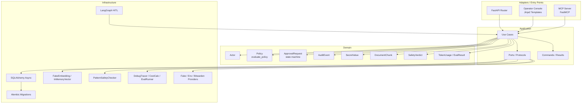
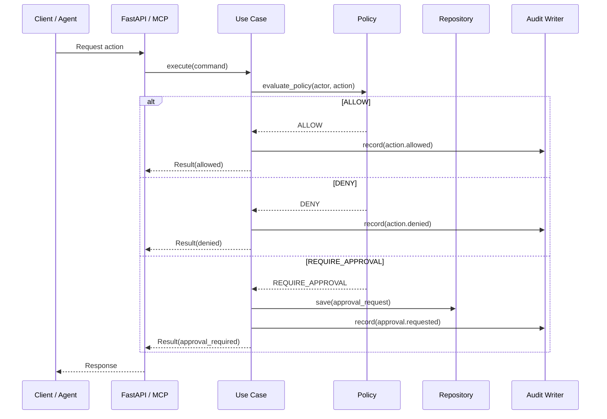
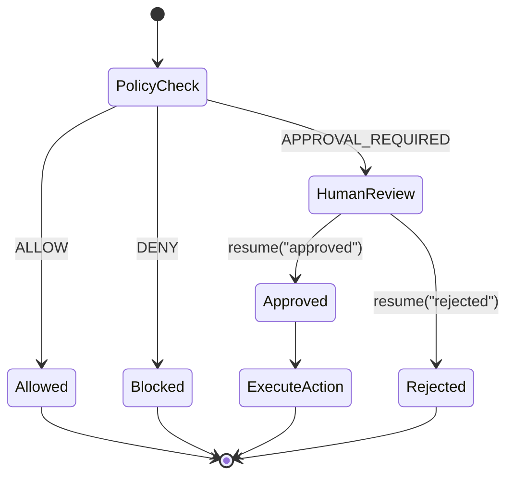

# Architecture

## Layer Diagram



## Request Flow (Approval)



## HITL Workflow



## Directory Map

```
src/secure_agentic_ai/
├── domain/                  # Pure domain
│   ├── actors.py            Actor dataclass
│   ├── policies.py          Policy decisions, ActionType, RiskLevel
│   ├── approvals.py         ApprovalRequest state machine
│   ├── audit.py             AuditEvent with trace support
│   ├── knowledge.py         DocumentChunk, RetrievedChunk
│   ├── safety.py            SafetyVerdict, SafetyRiskLevel
│   ├── secrets.py           SecretValue with masked repr
│   └── observability.py     TokenUsage, CostEstimate, EvalCase/Result
│
├── application/             # Use cases and ports
│   ├── commands.py          RequestActionCommand, ResolveSecretCommand
│   ├── ports.py             Protocols: ApprovalRequestRepository, AuditWriter,
│   │                        EmbeddingProvider, VectorStore, SafetyChecker,
│   │                        Tracer, AuditReader, SecretProvider
│   └── use_cases.py         RequestActionUseCase, ResolveSecretUseCase,
│                            IngestDocumentUseCase, RetrieveContextUseCase
│
├── adapters/api/            # FastAPI entry points
│   ├── app.py               FastAPI app factory with lifespan
│   ├── dependencies.py      DI: DB session, repos, use cases
│   ├── routes.py            /health, /actions endpoints
│   ├── schemas.py           Pydantic request/response schemas
│   ├── operator_router.py   /operator/ dashboard, approvals, audit
│   └── templates/           Jinja2 HTML templates
│
└── infrastructure/          # Concrete implementations
    ├── persistence/         SQLAlchemy async, Alembic migrations
    ├── workflows/           LangGraph HITL workflow
    ├── knowledge/           FakeEmbeddingProvider, InMemoryVectorStore
    ├── security/            PatternSafetyChecker, injection regexes
    ├── mcp/                 FastMCP server, tool handler
    ├── secrets/             Fake/Env/Bitwarden providers
    └── observability/       DebugTracer, CostCalculator, EvalRunner
```
