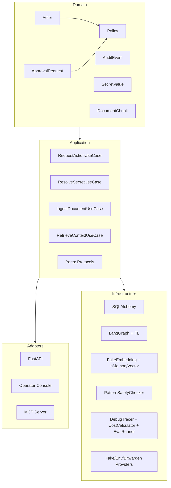

# Secure Agentic AI Platform

**Security-first governance for agentic AI workflows.**  
A portfolio-grade Python platform demonstrating HITL approval gates, RAG, prompt injection detection, observability, MCP tool exposure, and audit-ready architecture.



## Demo

```bash
uv sync
uv run python scripts/seed_demo.py
uv run uvicorn src.secure_agentic_ai.adapters.api.app:app
```

Open http://127.0.0.1:8000/operator/ to review pending approval requests.

## Octa Workspace MVP (localhost)

Local CEO workspace on **M5 only** ([ADR 006](docs/adr/006-m5-only-dev-strategy.md)): chat with the Personal Agent, hash panels (`#Planning`, `#Board`, `#Wiki`, `#Review`, `#Retro`, `#Zasady`), Knowledge RAG, HITL review, and MCP read-only tools — **no** prod deploy or HYDRA integration in this phase.

Full architecture: [docs/architecture/workspace-mvp.md](docs/architecture/workspace-mvp.md)

### Quick start (< 15 min)

**Requirements:** [uv](https://docs.astral.sh/uv/) (Python 3.13). Optional: Node 22 (E2E), Docker (Qdrant), macOS Keychain (MiniMax/DeepSeek), local clone of the Knowledge repo.

```bash
git clone https://github.com/octadecimal-agents/octadecimal.pro.git
cd octadecimal.pro
uv sync
./scripts/octa-mvp-up.sh
```

Open http://127.0.0.1:8042/

| URL | Role |
|-----|------|
| `/` | Workspace UI (chat + hash panels) |
| `/workspace/health` | Ops health (RAG, LLM, review queue, calendar) |
| `/operator/` | HITL operator console (same process) |

**Knowledge:** set `KNOWLEDGE_ROOT=~/Developer/Knowledge` (default). Without it, Wiki/RAG returns empty results.

**Always-on (optional):** after first manual run, install launchd for daily use:

```bash
./scripts/install-workspace-api-launchd.sh   # do not run together with octa-mvp-up.sh
```

See [daily dev runbook](docs/runbooks/workspace-daily-dev.md).

**Options:**

```bash
export LLM_PROVIDER=minimax          # default: dry (no API key)
export RAG_BACKEND=qdrant            # requires: ./scripts/octa-qdrant-dev.sh
./scripts/octa-mvp-up.sh
```

**Verify:**

```bash
curl -s http://127.0.0.1:8042/workspace/health | python3 -m json.tool
uv run pytest                        # 169 tests
cd e2e && npm ci && npm test         # 9 Playwright scenarios
```

**Docs:** [workspace-mvp.md](docs/architecture/workspace-mvp.md) · [M5.x roadmap](docs/planning/workspace-mvp-roadmap.md) · [M5.5 sign-off](docs/planning/workspace-mvp-m5-5-signoff.md) · [ADR 006](docs/adr/006-m5-only-dev-strategy.md)

**Quality gates (same as CI):**

```bash
uv run pytest
uv run ruff check src tests scripts
uv run mypy src
cd e2e && npm test
```

## What's Implemented

| Layer | Capability |
|-------|-----------|
| Domain | Actor, Action, Policy (ALLOW / DENY / REQUIRE_APPROVAL), ApprovalRequest (state machine), AuditEvent, DocumentChunk, SafetyVerdict, SecretValue (masked repr), TokenUsage, EvalResult |
| Application | RequestActionUseCase, ResolveSecretUseCase, IngestDocumentUseCase, RetrieveContextUseCase — all depend on `Protocol` ports, not concrete adapters |
| API | FastAPI with `/health`, `/actions`, and `/operator/` console (Jinja2 templates) |
| Persistence | SQLAlchemy async + Alembic migrations (SQLite dev, PostgreSQL ready) |
| HITL Workflow | LangGraph with policy_check → human_review → execute_action, interrupt/resume |
| RAG | Chunking, embedding, similarity search — pure Python (no numpy) |
| Security | Pattern-based prompt injection detection (direct + indirect), integrated into use case |
| Observability | Tracing spans, cost estimation (4 models), eval runner with synthetic test cases |
| MCP | FastMCP server with policy-governed `read_document` tool |
| Secrets | SecretProvider port + Fake / Env / Bitwarden adapters, masked `__str__`/`__repr__`, no value leakage to logs |
| Tests | 169 pytest + 9 Playwright E2E | CI on every push to `main` |
| Workspace | Octa CEO localhost MVP (`:8042`), RAG, AO evals, MCP read-only, launchd dev loop | [workspace-mvp.md](docs/architecture/workspace-mvp.md) |

## Architecture

Clean architecture with strict dependency rule:

```
FastAPI / MCP / Operator Console
         │
    Application Use Cases  ←  depend on Protocol ports
         │
    Domain  (pure Python, no framework imports)
         │
    Infrastructure  (SQLAlchemy, LangGraph, providers, checkers)
```

- **Domain** is synchronous, framework-free Python.
- **Application** coordinates domain logic via async use cases.
- **Adapters** (FastAPI, MCP) are thin I/O boundaries.
- **Infrastructure** provides concrete implementations behind `Protocol` ports.

## Layout

```
src/secure_agentic_ai/
├── domain/          # Pure domain models (dataclasses, enums, policy rules)
├── application/     # Use cases, commands, ports (Protocols)
├── adapters/api/    # FastAPI routes, schemas, DI, operator console
└── infrastructure/  # Persistence, LangGraph, RAG, security, MCP, secrets, observability

tests/
├── unit/            # Domain + use case tests (pure Python)
└── integration/     # DB, HITL, RAG, safety, MCP, secrets, observability
```

## Key Decisions

- **Async-first**: All ports and infrastructure are async (FastAPI, SQLAlchemy, LangGraph).
- **Protocol ports**: Dependencies are inverted — the domain never imports adapters.
- **HITL via interrupt**: LangGraph's `interrupt`/`resume` provides human-in-the-loop without polling.
- **RAG without numpy**: Pure Python cosine similarity keeps the dependency footprint small.
- **Masked secrets**: `SecretValue.__str__` returns `"****"` — values never reach logs or traces.
- **SQLite dev, PostgreSQL prod**: The adapter pattern makes switching trivial.
- **No ML classifier for safety**: Regex patterns are explicit, auditable, and testable.

## What's Planned

**Workspace (M5-only path):**

- [M5.6](docs/planning/workspace-mvp-m5-6-m1-server-mode.md) — always-on Workspace on M1
- [M5.7](docs/planning/workspace-mvp-m5-7-hosting-only.md) — pc-ubuntu hosting (deferred)
- [M6+ platform](docs/planning/workspace-mvp-m6-platform.md) — PostgreSQL, AI security, LangGraph

**Platform core:**

- OpenTelemetry / Langfuse integration (replace DebugTracer)
- MCP tool registry expansion
- End-to-end eval automation in CI
- Docker Compose for PostgreSQL deployment

## License

MIT
