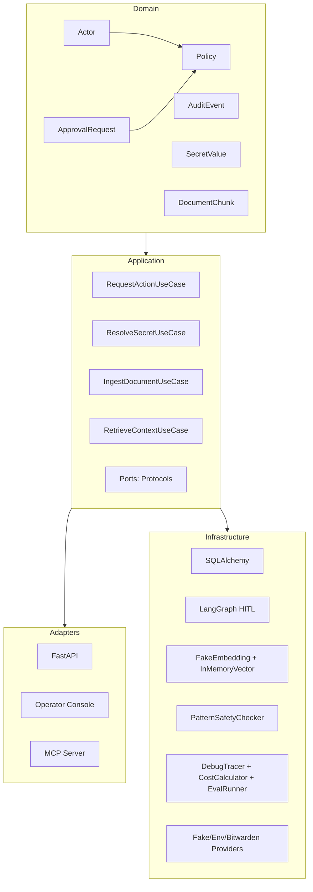

# Secure Agentic AI Platform

**Security-first governance for agentic AI workflows.**  
A portfolio-grade Python platform demonstrating HITL approval gates, RAG, prompt injection detection, observability, MCP tool exposure, and audit-ready architecture.



## Demo

```bash
uv sync
uv run python scripts/seed_demo.py
uv run uvicorn src.secure_agentic_ai.adapters.api.app:app
```

Open http://127.0.0.1:8000/operator/ to review pending approval requests.

```
# Quick checks
uv run pytest          # 62 tests
uv run ruff check .    # lint
uv run mypy src/       # types
```

## What's Implemented

| Layer | Capability |
|-------|-----------|
| Domain | Actor, Action, Policy (ALLOW / DENY / REQUIRE_APPROVAL), ApprovalRequest (state machine), AuditEvent, DocumentChunk, SafetyVerdict, SecretValue (masked repr), TokenUsage, EvalResult |
| Application | RequestActionUseCase, ResolveSecretUseCase, IngestDocumentUseCase, RetrieveContextUseCase — all depend on `Protocol` ports, not concrete adapters |
| API | FastAPI with `/health`, `/actions`, and `/operator/` console (Jinja2 templates) |
| Persistence | SQLAlchemy async + Alembic migrations (SQLite dev, PostgreSQL ready) |
| HITL Workflow | LangGraph with policy_check → human_review → execute_action, interrupt/resume |
| RAG | Chunking, embedding, similarity search — pure Python (no numpy) |
| Security | Pattern-based prompt injection detection (direct + indirect), integrated into use case |
| Observability | Tracing spans, cost estimation (4 models), eval runner with synthetic test cases |
| MCP | FastMCP server with policy-governed `read_document` tool |
| Secrets | SecretProvider port + Fake / Env / Bitwarden adapters, masked `__str__`/`__repr__`, no value leakage to logs |
| Tests | 62 tests across unit + integration — ALLOW, DENY, APPROVAL_REQUIRED, safety blocks, HITL pause/resume, audit, RAG, MCP, secrets, observability |

## Architecture

Clean architecture with strict dependency rule:

```
FastAPI / MCP / Operator Console
         │
    Application Use Cases  ←  depend on Protocol ports
         │
    Domain  (pure Python, no framework imports)
         │
    Infrastructure  (SQLAlchemy, LangGraph, providers, checkers)
```

- **Domain** is synchronous, framework-free Python.
- **Application** coordinates domain logic via async use cases.
- **Adapters** (FastAPI, MCP) are thin I/O boundaries.
- **Infrastructure** provides concrete implementations behind `Protocol` ports.

## Layout

```
src/secure_agentic_ai/
├── domain/          # Pure domain models (dataclasses, enums, policy rules)
├── application/     # Use cases, commands, ports (Protocols)
├── adapters/api/    # FastAPI routes, schemas, DI, operator console
└── infrastructure/  # Persistence, LangGraph, RAG, security, MCP, secrets, observability

tests/
├── unit/            # Domain + use case tests (pure Python)
└── integration/     # DB, HITL, RAG, safety, MCP, secrets, observability
```

## Key Decisions

- **Async-first**: All ports and infrastructure are async (FastAPI, SQLAlchemy, LangGraph).
- **Protocol ports**: Dependencies are inverted — the domain never imports adapters.
- **HITL via interrupt**: LangGraph's `interrupt`/`resume` provides human-in-the-loop without polling.
- **RAG without numpy**: Pure Python cosine similarity keeps the dependency footprint small.
- **Masked secrets**: `SecretValue.__str__` returns `"****"` — values never reach logs or traces.
- **SQLite dev, PostgreSQL prod**: The adapter pattern makes switching trivial.
- **No ML classifier for safety**: Regex patterns are explicit, auditable, and testable.

## What's Planned

- OpenTelemetry / Langfuse integration (replace DebugTracer)
- MCP tool registry expansion
- End-to-end eval automation in CI
- Docker Compose for PostgreSQL deployment

## License

MIT
