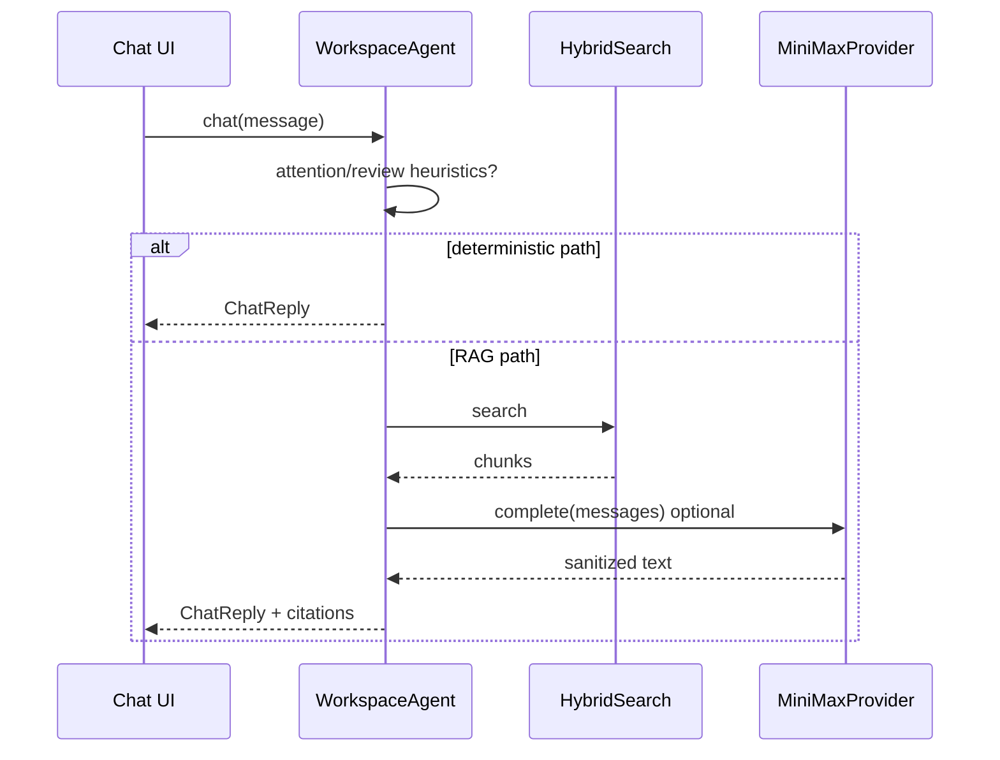

<link rel="stylesheet" href="../styles/main.css">

# Rozszerzenia po Sprint 3 (zamknięte)

[← Indeks zamkniętych prac](workspace-mvp-done-index.md) · [Sprint 3](workspace-mvp-sprint-3-retro-infra.md)

**Status:** ✅ done · **2026-06-14**

Prace **poza pierwotnym podziałem Sprint 0–3**, ale przed fazą M5.1 — uzupełnienia jakości, LLM produkcyjny, testy przeglądarkowe.

---

## Przegląd rozszerzeń

| Obszar | Commit(y) | Cel |
|--------|-----------|-----|
| DeepSeek LLM | `820c492` | OpenAI-compatible API + BSM |
| MiniMax LLM | `0c54c97` | Primary external LLM + reasoning filter |
| Review UX | `d0f219b` | Badge + attention (częściowo Sprint 2+) |
| JS fix Review | `3ec1e03` | `async function loadReview` |
| Playwright E2E | `856409e`, `9b6e3a7` | 9 scenariuszy MVP |
| E2E seed DATABASE_URL | `856409e` | izolowana baza w CI |

---

## LLM — DeepSeek i MiniMax

### Architektura providerów

```text
ChatCompletionProvider (port)
        │
        ├── DryChatProvider          is_available() = False
        ├── OpenAICompatProvider     wspólna baza HTTP
        │       ├── DeepSeekProvider
        │       └── MiniMaxProvider
        └── factory.build_chat_provider(config)
```

**Pliki:**

- `infrastructure/llm/factory.py`
- `infrastructure/llm/openai_compat_provider.py`
- `infrastructure/llm/deepseek_provider.py`
- `infrastructure/llm/minimax_provider.py`
- `infrastructure/llm/secret_resolver.py`
- `infrastructure/llm/chat_prompts.py`

### Rozwiązywanie sekretów (kolejność)

```text
1. MINIMAX_API_TOKEN / DEEPSEEK_API_KEY (env)
2. BWS_ACCESS_TOKEN + project multi-agents-framework-m1
3. BW_SECRET_ID_* (UUID)
4. Bitwarden vault via Knowledge/tools/bitwarden
5. Keychain: pl.octadecimal.m1-runtime.BWS_ACCESS_TOKEN (octa-mvp-up.sh)
```

**Zasada:** brak tokenu → fallback dry (cichy — jawny komunikat → M5.3.6).

### Reasoning filter (`0c54c97`)

MiniMax zwraca bloki thinking — `sanitize_llm_reply()` usuwa m.in. `<think>` zanim tekst trafi do UI.

**Powód:** CEO widzi tylko odpowiedź, nie chain-of-thought modelu.

### Integracja z WorkspaceAgent

```python
llm_reply = await self._try_llm_reply(message, chunks, citations)
# build_rag_messages(message, context_blocks)
# parse_suggested_hash(reply_text)
```

LLM **nie zastępuje** ścieżek deterministycznych (attention, review, blocked).

---

## Playwright E2E

### Architektura testów

```text
e2e/
├── playwright.config.ts    webServer → octa-e2e-server.sh
├── tests/workspace.spec.ts
└── package.json

scripts/octa-e2e-server.sh
    port 18042
    LLM_PROVIDER=dry
    RAG_BACKEND=memory
    DATABASE_URL → data/e2e-playwright.db
    KNOWLEDGE_ROOT → e2e/.data/knowledge/Backup.md
```

### 9 scenariuszy

1. Boot + powitanie + health message  
2. Nawigacja `#Wiki`  
3. Wiki search → Backup.md  
4. Chat backup → Kanon + `#Wiki`  
5. Board — dodaj task  
6. Planning — kalendarz + generate  
7. Review — pending list  
8. Attention chat → Review  
9. Retro — zapis journal  

**Uruchomienie:** `cd e2e && npm install && npm test`

**CI:** job Playwright → [M5.1.2](workspace-mvp-m5-1-hardening.md) (jeszcze nie w GitHub Actions).

### `seed_demo.py` + DATABASE_URL

Rozszerzenie dla E2E: `create_async_engine(os.environ.get("DATABASE_URL", default))` — świeża baza approvals per run.

---

## Review badge i attention (doprecyzowanie)

Commit `d0f219b` — uzupełnienie Sprint 2:

- `/workspace/health.review_pending_count`
- Sidebar badge `#review-badge`
- Init chat: komunikat gdy pending > 0
- `format_attention_reply()` — „Review (N)” w chacie

**Architektura:** read path przez ten sam repo co approve — spójny licznik.

---

## Fix JavaScript Review panel

**Bug:** `async def loadReview()` — składnia Pythona w JS → panel Review martwy.

**Fix `3ec1e03`:** `async function loadReview()`.

**Lekcja:** E2E wychwytuje regresje UI; ten bug był blockerem dla checklisty Kanonu §10.

---

## Diagram LLM w request chat



---

## Metryki końcowe (2026-06-14)

| Metryka | Wartość |
|---------|---------|
| pytest | 110 passed |
| Playwright | 9 passed |
| Pliki workspace adapter | router + static + schemas |
| Infrastructure workspace | 10 modułów |
| Skrypty ops | octa-mvp-up, qdrant-dev, e2e-server, mcp-workspace |

---

## Co świadomie zostało na M5.1+

| Element | Faza |
|---------|------|
| CI Playwright | M5.1.2 |
| Idempotentny seed | M5.1.3 |
| `#Zasady` panel | M5.1.4 |
| Jawny fallback LLM w UI | M5.3.6 |
| Pełny quick start README | M5.1.6 |

---

## Powiązane commity (chronologicznie)

1. `820c492` — DeepSeek V4 + Bitwarden SM  
2. `0c54c97` — MiniMax + reasoning filter  
3. `d0f219b` — Review badge + attention  
4. `3ec1e03` — loadReview JS fix  
5. `856409e` — Playwright suite + E2E server  
6. `9b6e3a7` — playwright.config fix  
