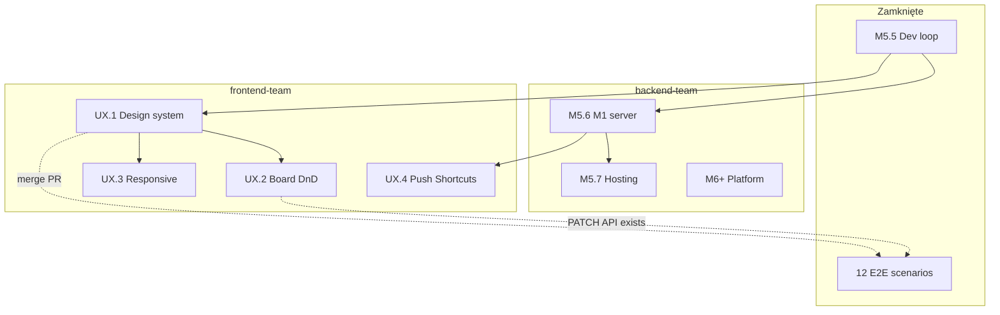

<link rel="stylesheet" href="../styles/main.css">

# Octa Workspace — dual-track: backend-team + frontend-team

[← Planning index](README.md) · [Roadmap](workspace-mvp-roadmap.md) · [Architektura](../architecture/workspace-mvp.md) · [ADR 006](../adr/006-m5-only-dev-strategy.md)

**Status:** active · **Data:** 2026-06-15 · **Właściciel kontraktu:** backend-team + frontend-team

Ten dokument opisuje **dwa równoległe wątki pracy** nad Octa Workspace MVP: **backend-team** (infra, API, M5.6+, Cursor) oraz **frontend-team** (UX/UI, design system, OpenCode + WDS/Freya). Służy jako onboarding dla frontend-team i jako SSOT synchronizacji między frameworkami agentowymi.

---

## 1. Wprowadzenie — czym jest projekt

### 1.1 Octa Workspace w kontekście platformy

**octadecimal.pro** to portfolio-grade platforma **Secure Agentic AI** — governance dla agentów AI: HITL, audyt, polityki ryzyka, RAG, MCP, observability. Rdzeń to czysta domena Python + FastAPI.

**Octa Workspace MVP** to cienka warstwa CEO na localhost:

- chat z **Agentem Osobistym (AO)**,
- panele hash (`#Planning`, `#Board`, `#Wiki`, `#Review`, `#Retro`, `#Zasady`),
- wyszukiwanie w repozytorium **Knowledge** (Markdown SSOT),
- kolejka akceptacji CEO (HITL),
- tablica zadań zespołów Octa (`platform`, `knowledge`, `ops`, `product` — slugi produktowe, nie nazwy zespołów dev).

Workspace **nie** jest produkcyjnym HYDRA ani pełnym `workspace.octadecimal.pro` — to lokalny prototyp pętli „typowego dnia CEO” opisanej w badaniach Octa OS.

### 1.2 Założenia strategiczne (ADR 006)

| Założenie | Opis |
|-----------|------|
| **M5-only dev** | Rozwój na Macu budowlanym (M5) do zamknięcia lokalnej pętli; bez mostu prod/HYDRA jako następnego kroku |
| **Markdown SSOT** | Kanon w `Knowledge/` (repo lokalne); RAG indeksuje T1 wg `policy.yaml` |
| **Kernel vs adapter** | Polityka, HITL, audit w `secure_agentic_ai`; UI to statyczne pliki + REST `/workspace/*` |
| **Bez legacy Ubuntu teams** | Tablica używa slugów Octa: `platform`, `knowledge`, `ops`, `product` |
| **HYDRA deferred** | Orchestracja na pc-ubuntu nie jest centrum Octa w tej fazie |
| **Multi-framework OK** | backend-team (Cursor), frontend-team (OpenCode) — ten sam git, różne runtime agentów |

### 1.3 Role węzłów (docelowe)

| Węzeł | Rola |
|-------|------|
| **M5** | Dev/build: git, pytest, E2E, `embed-knowledge sync --dev`, CI — głównie **backend-team** |
| **M1** | Daily driver + **server mode** (M5.6): Workspace 24/7 u CEO |
| **pc-ubuntu** | **Hosting only** (M5.7, deferred): backup Qdrant, HTTPS — bez floty agentów |

### 1.4 Cele do osiągnięcia (cały projekt)

**Krótkoterminowe (M5.x):**

1. CEO korzysta z Workspace codziennie bez ręcznego startu terminala (M5.5 ✅ na M5, M5.6 na M1).
2. AO odpowiada z Kanonu (RAG + dry/MiniMax), sugeruje właściwe panele hash.
3. HITL: widać kolejkę, badge, approve/reject; audyt spójny z `/operator/`.
4. Jakość: zielone CI (pytest + Playwright), runbooki operacyjne.

**Średnioterminowe (M5.7 + M6+):**

5. Hosting warstwy danych (prod Qdrant backup, HTTPS) — **bez** integracji HYDRA.
6. Platforma core: PostgreSQL, LangGraph HITL, AI security, observability (fazy 5–13).

**Równoległe (frontend-team):**

7. Wygląd i UX zbliżone do docelowego `workspace.octadecimal.pro` (design system, responsywność, lepsza tablica).
8. Implementacja UX w osobnych PR-ach — **bez blokowania** M5.6 (backend-team).

**Świadomie poza zakresem (teraz):**

- `#Dev` / git / CRM (`UX.6`),
- `embed-knowledge sync --prod`,
- pełna flota agentów na Ubuntu.

### 1.5 Kanon i dokumentacja

| Typ | Lokalizacja |
|-----|-------------|
| Architektura runtime (EN) | [workspace-mvp.md](../architecture/workspace-mvp.md) |
| Roadmapa faz (EN) | [workspace-mvp-roadmap.md](workspace-mvp-roadmap.md) |
| Kanon operacyjny (PL) | `Knowledge/.../octa-os/mvp-localhost-m5.md` |
| Założenia biznesowe (PL) | `Knowledge/.../octa-os/zalozenia/OCTA-ZALOZENIA.md` |
| E2E | [e2e/README.md](../../e2e/README.md) |
| Daily dev | [workspace-daily-dev.md](../runbooks/workspace-daily-dev.md) |

---

## 2. Nazewnictwo zespołów i model dual-track

### 2.1 Oficjalne nazwy wątków

| Nazwa | Zakres | Framework agentowy | Gałęzie git (przykład) |
|-------|--------|--------------------|-------------------------|
| **backend-team** | API, infra, skrypty, launchd, testy backend/E2E, fazy M5.6–M6+ | Cursor | `feat/m5-6-*`, `feat/m5-*` |
| **frontend-team** | UI (`static/`), design system, UX backlog, `design-artifacts/` | OpenCode (+ WDS/Freya) | `feat/ux-*`, `feat/frontend-*` |

W dokumentacji używaj **`backend-team`** i **`frontend-team`** zamiast ogólnych „Track A/B” lub „Dev/UX team”, gdy chodzi o właścicielstwo pracy lub synchronizację.

**Nie mylić z:** slugami tablicy Board (`platform`, `knowledge`, …) — to kategorie produktowe Octa, nie zespoły dev.

### 2.2 Diagram współpracy

```text
┌─────────────────────────────────────┐   ┌─────────────────────────────────────┐
│  backend-team                       │   │  frontend-team                      │
│  Framework: Cursor                  │   │  Framework: OpenCode (+ WDS/Freya)  │
├─────────────────────────────────────┤   ├─────────────────────────────────────┤
│  M5.6 launchd M1, API always-on    │   │  UX.1 design system                 │
│  M5.7 hosting (deferred)            │   │  UX.2 drag-and-drop Board           │
│  M6+ platform core (parallel)       │   │  UX.3 responsive / mobile           │
│  scripts/, router, infra, tests     │   │  UX.4 Push/Shortcuts (po M5.6)      │
│  Branch: feat/m5-6-* → main         │   │  design-artifacts/, static/         │
│                                     │   │  Branch: feat/ux-* → main           │
└──────────────────┬──────────────────┘   └──────────────────┬──────────────────┘
                   │                                            │
                   └────────────► KONTRAKT (git + docs) ◄────────┘
                         merge tylko przez PR + zielone CI
```

**Zasada nadrzędna:** stan projektu = **repozytorium + pliki markdown**, nie pamięć sesji agenta (Cursor transcript ≠ OpenCode engram).

---

## 3. Co zostało zrealizowane (stan na 2026-06-15)

*Dotyczy głównie pracy **backend-team**; UI to funkcjonalny MVP — punkt startowy **frontend-team**.*

### 3.1 MVP core (Sprint 0–3) — ✅ zamknięte

Szczegóły: [workspace-mvp-done-index.md](workspace-mvp-done-index.md).

| Obszar | Efekt | Weryfikacja |
|--------|-------|-------------|
| Boot | `./scripts/octa-mvp-up.sh` → `:8042` | UI 200, `/workspace/health` OK |
| UI hash | `#Ogolny` … `#Retro`, `#Zasady` | Nawigacja bez błędów JS |
| Chat AO | RAG + heurystyki (`dry`) + MiniMax (BSM) | pytest + E2E |
| Wiki | Hybrid search, cytaty ze ścieżek md | E2E: `Backup.md` |
| Board | CRUD w `OCTA_LEDGER` (SQLite) | E2E + restart |
| Planning | Generowanie planu, edycja, fixture/`calctl` | E2E |
| Review HITL | Kolejka, badge, approve/reject, „co wymaga uwagi?” | E2E + operator |
| Retro | Zapis journal md | E2E |
| RAG dev | Qdrant `:6335`, `embed-knowledge sync --dev` | manifest SHA-256 |
| MCP | Narzędzia read-only + kalendarz | test integracyjny |

### 3.2 Fazy M5.1–M5.5 — ✅ zamknięte (backend-team)

| Faza | Skrót | Dokument |
|------|-------|----------|
| M5.1 | Checklist, CI Playwright, seed idempotent, `#Zasady`, health | [m5-1](workspace-mvp-m5-1-hardening.md) |
| M5.2 | `policy.yaml` T1, pełny ingest, metryki RAG, launchd sync 6h | [m5-2](workspace-mvp-m5-2-rag-scale.md) |
| M5.3 | Persona AO v2, narzędzia strukturalne, evals, dry fallback | [m5-3](workspace-mvp-m5-3-ao-evals.md) |
| M5.4 | `calctl`, MCP read-only, mail stub, ADR 002 | [m5-4](workspace-mvp-m5-4-macos-mcp.md) |
| M5.5 | Runbook daily dev, launchd API, teamy Octa-native, sign-off v2 | [m5-5](workspace-mvp-m5-5-m5-complete.md) · [sign-off](workspace-mvp-m5-5-signoff.md) |

**M5.5 — deliverables operacyjne:**

- [workspace-daily-dev.md](../runbooks/workspace-daily-dev.md)
- `scripts/install-workspace-api-launchd.sh`, `octa-workspace-api-dev.sh`
- Board teams: `platform`, `knowledge`, `ops`, `product` + migracja legacy
- README + Kanon §11 zaktualizowane

### 3.3 Testy i CI — ✅ aktualne

| Suite | Stan | Właściciel utrzymania |
|-------|------|------------------------|
| pytest | 169 testów | backend-team (frontend-team przy zmianach UI/API) |
| Playwright E2E | 12 scenariuszy ([e2e/README.md](../../e2e/README.md)) | oba zespoły |
| CI | GitHub Actions na `main` | oba zespoły |

**Ostatnie rozszerzenie E2E (backend-team):** teamy Board, `GET /workspace/health`, approve/reject w `#Review`.

### 3.4 UI — stan wyjściowy dla frontend-team

Obecny UI to **funkcjonalny MVP**, nie docelowy design:

- Pliki: `src/secure_agentic_ai/adapters/workspace/static/` (`index.html`, `app.js`, `styles.css`)
- Ciemny motyw z CSS variables (`--bg`, `--accent`, …)
- Brak design systemu zgodnego z `workspace.octadecimal.pro`
- `#Dev`, `#Burndown`, `#Ranking` — placeholdery „wkrótce”
- Status zadań na Board: `<select>`, bez drag-and-drop

To jest **punkt startowy frontend-team**, nie wymóg blokujący backend-team (M5.6).

---

## 4. Co będzie realizowane

### 4.1 backend-team — infra, API, platforma (Cursor)

**Następny krok: [M5.6 — M1 server mode](workspace-mvp-m5-6-m1-server-mode.md)**

| ID | Zadanie | Opis |
|----|---------|------|
| M5.6.1 | launchd na M1 | Workspace API + UI 24/7 na daily driver |
| M5.6.2 | Binding sieci | `127.0.0.1` vs Tailscale LAN; brak public exposure |
| M5.6.3 | Kalendarz na M1 | `CALENDAR_PROVIDER=auto` — live EventKit |
| M5.6.4 | Shortcuts / CLI | Opcjonalnie `octa workspace open` |
| M5.6.5 | Failover doc | Degradacja gdy M5 nadpisuje API w dev |

**Po M5.6 (deferred / parallel):**

- [M5.7](workspace-mvp-m5-7-hosting-only.md) — hosting pc-ubuntu (backup, HTTPS), bez HYDRA
- [M6+](workspace-mvp-m6-platform.md) — fazy platformy 5–13 (PostgreSQL, LangGraph, security, …)

**backend-team nie planuje** większych zmian UI poza koniecznymi fixami i aktualizacją kontraktu API/E2E.

### 4.2 frontend-team — UX/UI (OpenCode)

Backlog z [roadmapy](workspace-mvp-roadmap.md#ux-backlog-non-critical):

| ID | Zadanie | Priorytet | Zależność od backend-team |
|----|---------|-----------|---------------------------|
| **UX.1** | Design system (Figma → CSS tokens) | P0 | Brak — tylko `static/` + `design-artifacts/` |
| **UX.2** | Drag-and-drop na `#Board` | P1 | API `PATCH /workspace/board/tasks/{id}` **już istnieje** |
| **UX.3** | Mobile / responsive, sidebar collapse | P1 | Brak |
| **UX.4** | Push / Shortcuts M1 | P2 | **Po M5.6** (stabilny always-on API) |
| **UX.5** | Voice AO (Ollama/Whisper) | P2 | Design teraz; implementacja później |
| **UX.6** | `#Dev`, `#Burndown`, `#Ranking` | ⏸ deferred | Integracja git/CRM — osobna decyzja produktowa |

**Proponowana kolejność frontend-team:**

1. UX.1 — audyt UI vs `workspace.octadecimal.pro`, tokeny, typografia, spacing
2. UX.1 — spec per panel (`#Ogolny`, `#Board`, `#Review`, …)
3. UX.3 — breakpoints i sidebar
4. UX.2 — DnD Board (Work Order + branch implementacji)
5. UX.4 — po zamknięciu M5.6 (backend-team)

**Metodologia (zalecana):** WDS Product Evolution (`wds-8`) lub agent Freya — komendy w `.opencode/commands/`.

**Artefakty frontend-team (docelowa struktura):**

```text
design-artifacts/workspace/
├── ux.1-design-system/
│   ├── audit.md
│   ├── tokens.css          # propozycja — merge do static/styles.css w PR
│   └── work-order.md       # handoff do implementacji
├── ux.2-board-dnd/
│   └── work-order.md
└── design-log.md           # status cykli (opcjonalnie mirror _bmad-output)
```

---

## 5. Punkty synchronizacji kontraktów

Synchronizacja = **moment, w którym backend-team i frontend-team muszą się zgodzić na wspólny stan**, zanim którykolwiek wątek idzie dalej.

### 5.1 Kontrakt API (zamrożony do zmiany ADR)

**Dokument SSOT:** [workspace-mvp.md](../architecture/workspace-mvp.md) · **Właściciel:** backend-team

| Endpoint / element | Kontrakt |
|--------------------|----------|
| `GET /workspace/health` | Pola w `HealthWorkspaceResponse` — rozszerzenia OK, usuwanie wymaga aktualizacji E2E |
| `POST /workspace/chat` | `message`, `active_hash`; odpowiedź z `suggested_hash` |
| `GET/POST/PATCH /workspace/board/tasks` | `team` ∈ `{platform,knowledge,ops,product}` |
| `GET /workspace/review/pending` | Lista pending HITL |
| `POST /workspace/review/{id}/approve\|reject` | Zmiana statusu + audyt |
| `GET /workspace/wiki/search?q=` | Wyniki RAG z `source`, `score`, `excerpt` |
| `/workspace/planning/*`, `/workspace/retro` | Jak w architekturze |

**Kiedy synchronizować:**

- **backend-team** dodaje/usuwa/zmienia endpoint → PR + aktualizacja architektury + powiadomienie frontend-team (jeśli UI musi reagować)
- **frontend-team** potrzebuje nowego pola API → Work Order → backend-team implementuje **przed** merge UI zależnego od pola

### 5.2 Kontrakt UI — panele hash

| Hash | Rola | Zmiana wymaga |
|------|------|---------------|
| `#Ogolny` | Chat AO | ADR lub wpis w design-log + E2E |
| `#Planning` | Plan dnia | j.w. |
| `#Board` | Tablica | j.w. |
| `#Wiki` | Knowledge search | j.w. |
| `#Review` | HITL CEO | j.w. |
| `#Retro` | Dziennik | j.w. |
| `#Zasady` | Kanon linki | j.w. |
| `#Dev`, `#Burndown`, `#Ranking` | Placeholder | UX.6 — **nie implementować** bez decyzji produktowej |

### 5.3 Kontrakt selektorów E2E (anchors)

Playwright: [e2e/tests/workspace.spec.ts](../../e2e/tests/workspace.spec.ts)

**Nie usuwać ani nie przenosić bez aktualizacji testów:**

| Selektor | Użycie |
|----------|--------|
| `#chat-log`, `#chat-input`, `#chat-form` | Boot, chat |
| `.nav-link[data-hash="#…"]` | Nawigacja hash |
| `#panel-Wiki`, `#wiki-query`, `#wiki-form`, `#wiki-results` | Wiki |
| `#task-list`, `#new-team`, `#new-title`, `#add-task-btn` | Board |
| `.badge` | Team label na karcie |
| `#review-list`, `.btn-approve`, `.btn-reject`, `#review-badge` | Review HITL |
| `#plan-list`, `#generate-plan-btn`, `#calendar-list` | Planning |
| `#retro-form`, `#retro-preview` | Retro |

**frontend-team może** zmieniać klasy wizualne, kolory, layout — **o ile anchors pozostają** lub PR zawiera aktualizację E2E.

### 5.4 Kontrakt plików (ownership)

| Ścieżka | Właściciel primarny | Właściciel secondary |
|---------|---------------------|----------------------|
| `scripts/`, `docs/runbooks/` | backend-team | — |
| `src/.../workspace/router.py`, schemas | backend-team | frontend-team (propozycje przez WO) |
| `src/.../workspace/static/` | frontend-team (PR) | backend-team (hotfix) |
| `design-artifacts/` | frontend-team | — |
| `e2e/` | oba zespoły | zmiana przy dotknięciu UI/API |
| `docs/architecture/workspace-mvp.md` | backend-team | frontend-team (PR z review) |
| `docs/planning/workspace-mvp-dual-track.md` | oba zespoły | aktualizacja przy zmianie procesu |

### 5.5 Moment merge (obowiązkowa brama)

Każdy PR do `main` (backend-team lub frontend-team):

1. `uv run pytest` — green
2. `cd e2e && npm test` — green
3. Brak sekretów w diff
4. Jeśli dotyka kontraktu API/hash/selektorów — zaktualizowany docs

**Konflikt gałęzi:** rebase frontend-team na `main` przed merge; nie pracować tygodniami na stale branch.

### 5.6 Kalendarz synchronizacji (zalecany)

| Cadence | Co | Kto |
|---------|-----|-----|
| **Przy każdym PR** | CI, kontrakt selektorów | autor PR |
| **Po zamknięciu fazy backend** (np. M5.6) | Notatka w `design-artifacts/`: „API stable for UX.4” | backend-team → frontend-team |
| **Po Work Order UX** | Review WO (API, E2E) | frontend-team → backend-team |
| **Co 1–2 tyg.** (opcjonalnie) | 15 min: otwarte PR, blokery, następny WO | CEO / leady obu zespołów |

---

## 6. Zasady współpracy (bezpieczne i optymalne)

### 6.1 Git i branch strategy

```text
main                         ← zawsze deployable, CI green
├── feat/m5-6-*              ← backend-team
├── feat/m5-6-calendar       ← backend-team (wąski slice OK)
├── feat/ux-*                ← frontend-team
└── feat/frontend-*          ← frontend-team (alias dopuszczalny)
```

- **Nigdy** oba zespoły na jednym branchu bez uzgodnienia.
- **Preferuj małe PR** (1 Work Order = 1 PR).
- W opisie PR podawaj zespół: `[backend-team]` lub `[frontend-team]` w tytule lub body.
- Commit messages: conventional commits, focus on „why” ([CONTRIBUTING.md](../../CONTRIBUTING.md)).

### 6.2 Frameworki agentowe

| | backend-team | frontend-team |
|---|--------------|---------------|
| Runtime | Cursor | OpenCode |
| Skills | `.claude/skills/`, BMAD dev | `.opencode/commands/`, WDS Freya |
| Pamięć sesji | Transcript Cursor | engram / własna — **nie jest SSOT** |
| SSOT | **Git + markdown w repo** | **Git + markdown w repo** |

OpenCode i Cursor **nie muszą** dzielić historii czatu — wystarczy ten dokument + Work Orders + roadmap.

### 6.3 Fazy pracy frontend-team (design → code)

1. **Analyze** — audyt obecnego UI (bez commitu do `static/`)
2. **Spec** — tokeny, layout, stany → `design-artifacts/`
3. **Work Order** — lista plików, anchors do zachowania, kryteria akceptacji
4. **Review WO** — backend-team potwierdza: API wystarczy, E2E plan jasny
5. **Implement** — branch `feat/ux-*`, zmiany `static/` (+ e2e jeśli trzeba)
6. **PR + CI** — merge po green

**frontend-team nie powinien** w pierwszej sesji masowo refaktorować `static/` bez WO — ryzyko łamania E2E i konfliktów z M5.6 (backend-team).

### 6.4 Czego unikać

| Antywzorzec | Skutek |
|-------------|--------|
| Oba zespoły commitują na `main` bez branchy | Konflikty, broken CI |
| frontend-team zmienia API w `router.py` bez backend-team | Naruszenie ownership, brak testów backend |
| backend-team zmienia CSS „przy okazji” M5.6 | Rozjazd z design systemem frontend-team |
| Nowe panele hash bez ADR | Rozpad kontraktu nawigacji |
| Poleganie na pamięci agenta zamiast WO | Utrata kontekstu między OpenCode a Cursor |

### 6.5 Bezpieczeństwo

- Sekrety: Keychain / BSM — **nigdy** w repo ([SECURITY.md](../../SECURITY.md))
- M5.6: binding `127.0.0.1` lub Tailscale — **bez** publicznego exposure bez M5.7 + auth
- frontend-team: nie commitować `_bmad-output/` lokalnych artefaktów sesji (chyba że świadomie `design-artifacts/`)

### 6.6 Definition of Done (wspólna)

1. Kod + testy (unit/integration/E2E wg zakresu)
2. Aktualizacja docs jeśli kontrakt się zmienił
3. CI green na PR
4. frontend-team: wizualna akceptacja CEO na `./scripts/octa-mvp-up.sh` (lub launchd)

---

## 7. Onboarding — szybki start per zespół

### 7.1 backend-team — już w toku (Cursor)

```bash
cd octadecimal.pro
uv sync
./scripts/octa-mvp-up.sh          # http://127.0.0.1:8042
uv run pytest
cd e2e && npm install && npm test
```

Następny doc: [workspace-mvp-m5-6-m1-server-mode.md](workspace-mvp-m5-6-m1-server-mode.md)

### 7.2 frontend-team — OpenCode

```bash
cd octadecimal.pro
opencode
# /wds-8-product-evolution   lub   /wds-agent-freya-ux
```

**Kickoff (copy-paste do OpenCode):**

```text
Zespół: frontend-team
Repo: octadecimal.pro
Tryb: brownfield UX — równoległy do M5.6 (backend-team).
Przeczytaj: docs/planning/workspace-mvp-dual-track.md (ten dokument),
  docs/architecture/workspace-mvp.md, docs/planning/workspace-mvp-roadmap.md (UX backlog).
NIE dotykaj: scripts/, launchd, router.py (chyba że WO i uzgodnienie z backend-team).
Output: design-artifacts/workspace/ux.1-design-system/
Handoff: work-order.md + lista selektorów E2E do zachowania.
Implementacja: branch feat/ux-design-system, PR [frontend-team] z zielonym CI.
Pierwszy cel: UX.1 — design system vs workspace.octadecimal.pro.
```

**Podgląd UI lokalnie:**

```bash
./scripts/octa-mvp-up.sh
open http://127.0.0.1:8042/
```

---

## 8. Mapa zależności między zespołami



**Legenda:** linie ciągłe = zależność fazowa; przerywane = kontrakt istnieje, merge wymaga CI.

---

## 9. Powiązane dokumenty

- [Workspace MVP roadmap](workspace-mvp-roadmap.md)
- [M5.6 — M1 server mode](workspace-mvp-m5-6-m1-server-mode.md)
- [M5.5 sign-off](workspace-mvp-m5-5-signoff.md)
- [ADR 006 — M5-only strategy](../adr/006-m5-only-dev-strategy.md)
- [Workspace architecture](../architecture/workspace-mvp.md)
- [E2E README](../../e2e/README.md)
- [Daily dev runbook](../runbooks/workspace-daily-dev.md)
- WDS agent contracts: `_bmad/wds/data/agent-contracts.md`
- OpenCode commands: `.opencode/commands/wds-agent-freya-ux.md`

---

## 10. Historia dokumentu

| Data | Zmiana |
|------|--------|
| 2026-06-15 | Utworzenie — dual-track, onboarding OpenCode |
| 2026-06-15 | Nazewnictwo: **backend-team** + **frontend-team** |

*Aktualizuj sekcje 3–4 i 5.6 po zamknięciu M5.6 lub pierwszym merge frontend-team.*
