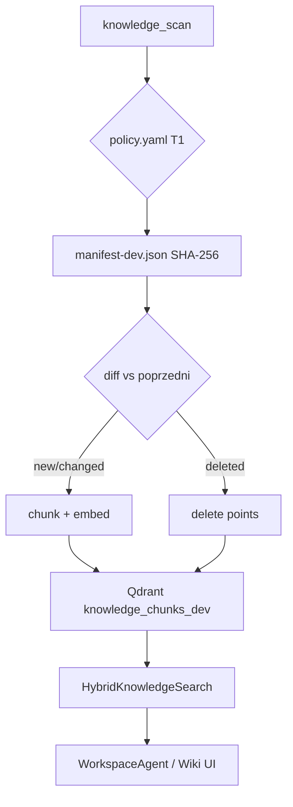

<link rel="stylesheet" href="../styles/main.css">

# Faza M5.2 — RAG i skala Knowledge

[← Workspace MVP roadmap](workspace-mvp-roadmap.md) · [Faza 7 platformy — RAG](phase-7-rag-foundation.md) · [Workspace MVP (EN)](../architecture/workspace-mvp.md)

**Status:** todo · **Szacunek:** 5–8 dni · **Priorytet:** P1 (po M5.1)

## Cel fazy

AO ma odpowiadać na pytania operacyjne CEO **z pełnego tieru T1 Kanonu** (~setki plików), nie tylko z ręcznie wybranych ścieżek demo. Jakość retrieval ma być **mierzalna** (golden queries), a sync **przyrostowy** i przewidywalny.

---

## Stan wyjściowy (MVP)

```text
KNOWLEDGE_ROOT (~/Developer/Knowledge)
        │
        ├── knowledge_scan.py      glob T1, strip HTML callouts
        ├── embed-knowledge.py     sync --dev | ingest
        └── manifest-dev.json      SHA-256 per plik
                │
                ▼
        RAG_BACKEND=memory | qdrant
                │
                ▼
        HybridKnowledgeSearch      vector + path token boost
                │
                ▼
        WorkspaceAgent._search()   top-k → chat / Wiki UI
```

Obecnie: ~77 plików w sync dev, hybrid re-ranking v1 (filename/path), `FakeEmbeddingProvider` lub Qdrant lokalnie `:6335`.

---

## Architektura docelowa

### Warstwy (bez mieszania z domeną governance)

| Warstwa | Moduł | Odpowiedzialność |
|---------|-------|------------------|
| Application | `RetrieveContextUseCase` | port retrieval, bez Qdrant |
| Infrastructure | `knowledge_scan.py`, `knowledge_sync.py` | ingest, manifest |
| Infrastructure | `hybrid_search.py` | re-rank po retrieval |
| Adapter | `scripts/embed-knowledge.py` | CLI sync/push |
| Workspace | `router.py` `/wiki/search` | HTTP dla UI |

**Zasada:** domena `ApprovalRequest` **nie importuje** RAG. Workspace agent używa RAG jako **portu kontekstu**.

### Dwa backendy wektorowe

```text
RAG_BACKEND=memory     → InMemoryVectorStore (CI, E2E, szybki dev)
RAG_BACKEND=qdrant     → Qdrant :6335, kolekcja knowledge_chunks_dev
```

Prod (M5.5): ta sama abstrakcja, inny URL/kolekcja.

---

## Zadania — szczegóły

### M5.2.1 — `policy.yaml` tier T1

**Status:** ✅ done (2026-06-15)

**Problem:** sync skanuje globs z kodu; brak jawnej polityki „co wolno embedować” w Kanonie.

**Lokalizacja:** `KNOWLEDGE_ROOT/.knowledge-index/policy.yaml`

**Propozycja schema:**

```yaml
version: 1
tiers:
  T1:
    include:
      - "01-Base-Point/**/*.md"
      - "02-6-Rooms-Model/_system/**/*.md"
    exclude:
      - "**/.git/**"
      - "**/node_modules/**"
      - "**/*.private.md"
  T2:
    include: []   # poza MVP — puste = skip
```

**Kroki:**

1. Parser YAML w `knowledge_scan.py` (fallback: obecne globs jeśli brak pliku).
2. Test: plik T2 poza whitelist → nie trafia do manifestu.
3. Dokumentacja w Knowledge + workspace-mvp.md.

**Done when:** `sync --dev --dry-run` respektuje policy; T2 ignorowane.

---

### M5.2.2 — Pełny ingest T1

**Status:** ✅ done (2026-06-15) — 79 plików T1 lokalnie, `embed-knowledge.py scan --dev`

**Kroki:**

1. `./scripts/octa-qdrant-dev.sh` — Qdrant na `:6335`.
2. `uv run python scripts/embed-knowledge.py sync --dev` na pełnym `KNOWLEDGE_ROOT`.
3. `curl /workspace/health` → `documents_indexed` >> 77 (oczekiwane: setki chunków z ~100+ plików).
4. Startup: `OCTA_REINDEX=0` — nie przebudowuje jeśli kolekcja ma punkty.

**Embedding provider (MVP):**

- Dev: `FakeEmbeddingProvider` (deterministyczny hash → wektor) — szybki, bez API.
- Opcjonalnie później: OpenAI/Ollama embedding port (osobne zadanie).

**Done when:** pytanie „backup Qdrant” nadal trafia w `Backup.md` na pełnym indeksie.

---

### M5.2.3 — Metryki retrieval

**Status:** ✅ done (2026-06-15)

**Cel:** debug i eval bez zgadywania.

**Rozwiązanie:**

1. `HybridKnowledgeSearch.search()` zwraca score breakdown (vector, path_boost).
2. Opcjonalny header `X-Debug-Retrieval: 1` na `/wiki/search` (dev only).
3. Log structured JSON: `query`, `top_sources[]`, `scores[]`.

**Test:** `tests/unit/infrastructure/test_hybrid_search.py` — golden query fixtures.

**Done when:** pytest na 5 zapytań; logi czytelne w dev.

---

### M5.2.4 — Re-ranking v2

**Status:** ✅ done (2026-06-15)

**Problem v1:** boost path/filename wystarcza dla „backup Qdrant”, słabiej dla semantyki ogólnej.

**Algorytm v2 (propozycja):**

```text
final_score = w1 * cosine_sim
            + w2 * path_token_match
            + w3 * heading_match      # nagłówki H1/H2 w chunku
            + w4 * recency_boost        # mtime pliku z manifestu
```

**Implementacja:** rozszerzyć `hybrid_search.py`; wagi w env lub `policy.yaml`:

```yaml
retrieval:
  weights:
    vector: 0.6
    path: 0.25
    heading: 0.1
    recency: 0.05
```

**Golden queries (minimum):**

| Query | Expected top source |
|-------|---------------------|
| backup Qdrant | `.../Backup.md` |
| Octa OS MVP | `.../mvp-localhost-m5.md` |
| HITL approval | docs policy / operator |
| embed knowledge | `knowledge-embeddings.md` |
| plan dnia CEO | `07-typowy-dzien-ceo.md` |

**Done when:** 5/5 golden w top-3 (test eval lub manual checklist).

---

### M5.2.5 — Harmonogram sync (launchd / cron)

**Status:** ✅ done (2026-06-15)

**Cel:** manifest aktualny bez ręcznego `embed-knowledge sync`.

**macOS launchd (M5):**

```xml
<!-- ~/Library/LaunchAgents/pl.octadecimal.embed-knowledge-dev.plist -->
<!-- co 6h: sync --dev -->
```

**Skrypt wrapper:** `scripts/octa-knowledge-sync-dev.sh` — log do `~/.octa/logs/embed-sync.log`.

**Instalacja launchd:** `scripts/install-embed-knowledge-launchd.sh` (szablon w `scripts/launchd/`).

**Runbook:** [knowledge-embed-sync-schedule.md](../runbooks/knowledge-embed-sync-schedule.md).

**Bezpieczeństwo:** tylko dev collection `:6335`; nigdy auto-push prod w tej fazie.

**Done when:** plik zmieniony w Knowledge → widoczny w Qdrant ≤ 6h (lub po ręcznym trigger).

---

### M5.2.6 — Startup edge cases

**Scenariusze:**

| Scenariusz | Oczekiwane zachowanie |
|------------|----------------------|
| Pusta kolekcja Qdrant, `OCTA_REINDEX=0` | Jednorazowy ingest przy starcie |
| Manifest nowszy niż Qdrant | Sync incremental |
| `KNOWLEDGE_ROOT` missing | Health `degraded` + czytelny błąd UI |
| Qdrant down, `RAG_BACKEND=qdrant` | Fallback memory **lub** fail loud (decyzja) |

**Rekomendacja:** fail loud w dev (łatwiejszy debug); E2E zostaje na `memory`.

**Done when:** test integration dla pustej kolekcji; dokumentacja env.

---

## Diagram przepływu sync



---

## Ryzyka

| Ryzyko | Mitigacja |
|--------|-----------|
| HTML callouts psują chunki | Preprocessor już w scan — rozszerzyć testy |
| Fake embeddings ≠ semantyka prod | Osobny task: real embeddings przed M5.5 |
| Duży ingest przy starcie | Lazy ingest + manifest; nie blokuj uvicorn > 30s |
| Prywatne pliki w Kanonie | `exclude` w policy.yaml |

---

## Kryterium ukończenia fazy

- [x] `policy.yaml` T1 w repozytorium Knowledge
- [x] Pełny sync dev; health pokazuje ≥ 79 dokumentów (lokalny Knowledge)
- [x] 5 golden queries PASS (unit parametrized)
- [x] Metryki retrieval w logach / debug header
- [x] launchd/cron opcjonalnie udokumentowany

---

## Powiązanie z platformą

Faza M5.2 realizuje **praktyczny slice** [Fazy 7 — RAG Foundation](phase-7-rag-foundation.md) w kontekście Workspace, bez czekania na pełną abstrakcję pgvector. Po M5.2 warto zaktualizować checklist Fazy 7 w README planowania.
