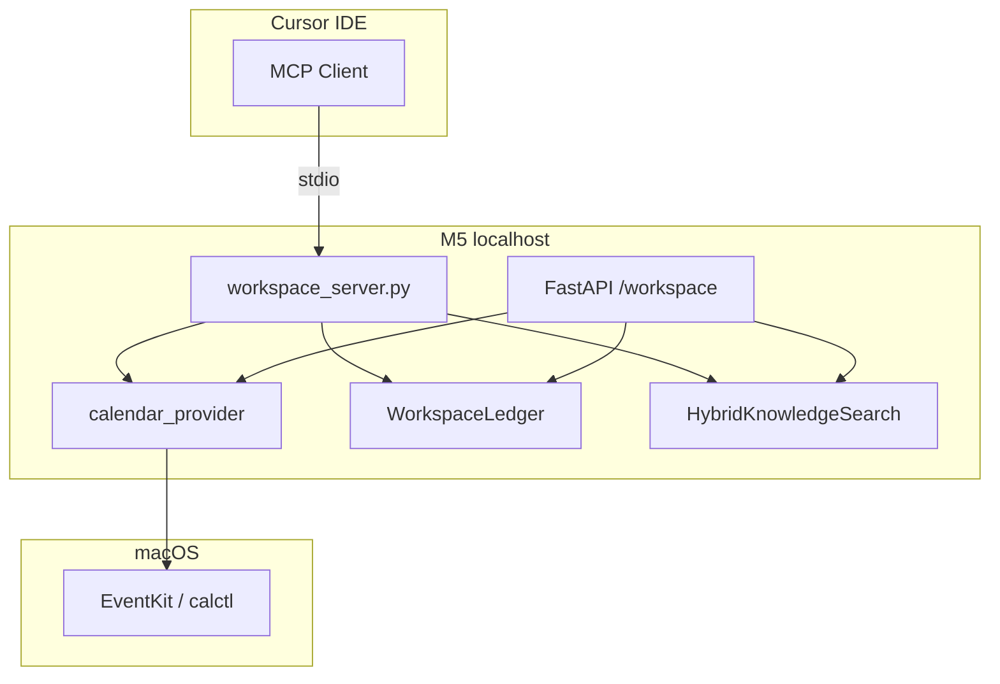

<link rel="stylesheet" href="../styles/main.css">

# Phase M5.4 — macOS MCP (live)

[← Workspace MVP roadmap](workspace-mvp-roadmap.md) · [Faza 10 — MCP](phase-10-mcp-tool-context.md) · [Workspace MVP (EN)](../architecture/workspace-mvp.md)

**Status:** ✅ done (2026-06-15)

## Cel fazy

`#Planning` ma korzystać z **prawdziwego kalendarza macOS** (gdy uprawnienia są), a Cursor — z **rozszerzonego MCP Workspace** do odczytu kontekstu CEO (kalendarz, board, wiki) bez kopiowania z UI.

Mail i pełny compose MCP pozostają **stubem** — tylko shape API i fixture.

---

## Stan wyjściowy

```text
CALENDAR_PROVIDER=auto | macos | fixture
        │
        ▼
calendar_provider.py
        ├── calctl / EventKit (macOS)
        ├── ~/.octa/calendar-cache.json
        └── OCTA_CALENDAR_FIXTURE JSON
                │
                ▼
GET /workspace/planning/calendar
                │
                ▼
MCP workspace_server.py
        ├── list_today_calendar
        └── workspace_health
```

Pliki:

- `infrastructure/macos/calendar_provider.py`
- `infrastructure/mcp/workspace_server.py`
- `scripts/octa-mcp-workspace.sh`
- `docs/architecture/mcp-workspace.example.json`

---

## Architektura MCP w Octa

### Zasada: MCP = adapter, nie domena

```text
Cursor / Claude Desktop
        │ stdio MCP
        ▼
workspace_server.py (FastMCP)
        │
        ├── read-only tools  → Planning, Wiki, Board list
        │
        └── write tools      → BLOKOWANE lub wymagają HITL (future)
                │
                ▼
        WorkspaceConfig.from_env()
        infrastructure adapters (calendar, ledger, search)
```

**Nigdy:** bezpośredni zapis do approvals z MCP bez policy check.

### Trzy warstwy dostawy kalendarza

| Warstwa | `source` w API | Użycie |
|---------|----------------|--------|
| Live | `macos` | M5 z uprawnieniami Calendars |
| Cache | `cache` | ten sam dzień, fallback po live read |
| Fixture | `fixture` | CI, E2E, brak uprawnień |

`CALENDAR_PROVIDER=auto`: macos → cache → fixture (kolejność w `list_today_calendar_events`).

---

## Zadania — szczegóły

### M5.4.1 — Production path `calctl`

**Problem:** AppleScript był zbyt wolny; `calctl` wymaga uprawnień i stabilnego cache.

**Kroki:**

1. Udokumentować runbook (M5.1.7 rozszerzenie): Terminal, Cursor, `calctl` binary path.
2. Test manualny 3 dni: porównać live vs cache vs fixture w `#Planning`.
3. `CALENDAR_INCLUDE` / `CALENDAR_EXCLUDE` — filtrowanie kalendarzy CEO (Dom, Praca, Ogarnianie).
4. Health: pole `calendar_source` już częściowo — dodać `calendar_events_count`.

**Edge cases:**

| Case | Zachowanie |
|------|------------|
| Permission denied | Log warning + fallback cache/fixture |
| Pusty kalendarz | UI: „Brak wydarzeń (źródło: macos)” |
| Midnight rollover | Invalidacja cache po dacie |

**Done when:** ≥1 live event w planie dnia na M5 z auto.

---

### M5.4.2 — Rozszerzenie MCP tools (read-only)

**Nowe narzędzia (propozycja):**

| Tool | Input | Output | Backend |
|------|-------|--------|---------|
| `wiki_search` | `query: str`, `k: int` | JSON chunks + sources | `HybridKnowledgeSearch` |
| `board_list_tasks` | `status?: str` | JSON tasks | `WorkspaceLedger` |
| `review_pending_summary` | — | count + top 3 titles | approval repo |

**Implementacja:** thin wrappers w `workspace_server.py` — reuse funkcji z routera (wyciągnąć shared helpers jeśli duplikacja).

**Test:** `tests/integration/test_workspace_mcp.py` — rozszerzyć listę tool names + smoke call.

**Cursor config:** zaktualizować `mcp-workspace.example.json`.

**Done when:** Cursor Agent może zapytać „co na boardzie blocked?” przez MCP.

---

### M5.4.3 — Mail stub

**Cel:** przygotować API shape bez prod IMAP.

**Propozycja:**

```python
# infrastructure/macos/mail_provider.py (stub)
async def list_unread_summary(config) -> tuple[list[MailItem], str]:
    # fixture: ~/.octa/mail-fixture.json
    # source: fixture | cache | macos (future)
```

**MCP (future tool):** `list_mail_summary` — **nie** w MVP M5.4 jeśli brak czasu; wystarczy moduł + fixture + test unit.

**Done when:** dokument „Mail stub” w tej fazie; brak live IMAP.

---

### M5.4.4 — Policy na MCP tools

**Reguły:**

| Operacja | MCP | Workspace UI | Policy |
|----------|-----|--------------|--------|
| Read calendar | ✅ | ✅ | allow |
| Read wiki | ✅ | ✅ | allow |
| Read board | ✅ | ✅ | allow |
| Create task | ❌ MCP | ✅ UI | write → future approval |
| Approve HITL | ❌ MCP | ✅ UI | HITL tylko human |

**Test denied:**

```python
async def test_mcp_no_write_tools_registered():
    names = await list_tool_names()
    assert "approve_review" not in names
    assert "board_create_task" not in names
```

**Done when:** test + komentarz w `workspace_server.py`.

---

### M5.4.5 — Compose MCP (decyzja dokumentacyjna)

**Opcje (z Kanonu `research/02-macos-automation-mcp.md`):**

| Opcja | Opis | Kiedy |
|-------|------|-------|
| A — Stub mono-process | Obecny `octa-mcp-workspace.sh` | M5.4 ✅ |
| B — Compose multi-server | Separate MCP: calendar, mail, knowledge | After [M5.7](workspace-mvp-m5-7-hosting-only.md) |
| C — Host agent na M1 | Shortcuts + lokalny most | Poza scope |

**Deliverable M5.4.5:** ADR section with recommendation **A now, B after M5.7 hosting** — see [ADR 002](../adr/002-mcp-compose-strategy.md).

---

## Diagram



---

## Ryzyka

| Ryzyko | Mitigacja |
|--------|-----------|
| Permission fatigue (macOS) | Cache + fixture; jasny runbook |
| MCP duplikuje REST | Shared service layer pod router + MCP |
| Secrets w MCP logs | Never log tokens; health only metadata |

---

## Kryterium ukończenia fazy

- [x] Live calendar na M5 (auto path)
- [x] MCP: wiki_search + board_list + review summary
- [x] Mail stub module + fixture (bez IMAP)
- [x] Policy test — brak write tools
- [x] Decyzja compose udokumentowana ([ADR 002](../adr/002-mcp-compose-strategy.md))

---

## Powiązane commity

1. `feat(mcp): add read-only wiki and board tools`
2. `docs(macos): calendar permissions and calctl runbook`
3. `feat(macos): mail provider stub with fixture`
4. `test(mcp): assert no write tools exposed`
