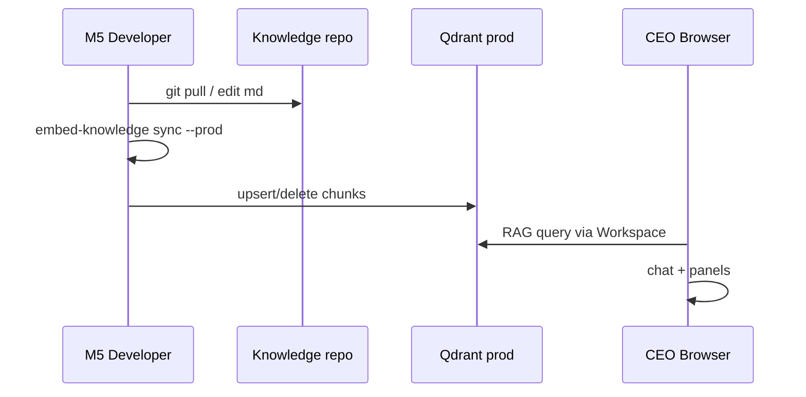

<link rel="stylesheet" href="../styles/main.css">

# Faza M5.5 — Most produkcyjny (HYDRA / pc-ubuntu)

[← Workspace MVP roadmap](workspace-mvp-roadmap.md) · [Faza 5 — Persistence](phase-5-async-persistence-audit.md) · [Workspace MVP (EN)](../architecture/workspace-mvp.md)

**Status:** todo · **Szacunek:** 2–3 tygodnie · **Priorytet:** P1 (po M5.2 + M5.3)

## Cel fazy

CEO używa **tego samego Workspace UI i AO** poza lokalnym M5 — z prod RAG na pc-ubuntu, kontrolowanym dostępem sieciowym i operacyjnym runbookiem backup/restore. **Bez przepisywania** adaptera Workspace — zmienia się konfiguracja, infrastruktura i persistence.

---

## Stan wyjściowy (localhost)

```text
M5 Mac
├── Workspace :8042
├── Qdrant dev :6335  → knowledge_chunks_dev
├── SQLite ledger + approvals (data/dev.db)
└── KNOWLEDGE_ROOT lokalny clone
```

---

## Architektura docelowa

```text
                    Tailscale / HTTPS
CEO browser ──────────────────────────────► workspace.octadecimal.pro
                                                    │
                    ┌───────────────────────────────┴───────────────────────────────┐
                    │                         pc-ubuntu (HYDRA)                      │
                    │  Qdrant :6333 → knowledge_chunks (prod)                          │
                    │  optional: FastAPI workspace backend                             │
                    │  nginx reverse proxy + auth                                      │
                    └───────────────────────────────┬───────────────────────────────┘
                                                    │
M5 (dev) ── embed-knowledge push ──────────────────►│
        manifest-prod.json                          │
```

### Separacja kolekcji

| Env | Qdrant | Kolekcja | Skrypt |
|-----|--------|----------|--------|
| Dev M5 | `:6335` | `knowledge_chunks_dev` | `sync --dev` |
| Prod pc-ubuntu | `:6333` | `knowledge_chunks` | `push` / `sync --prod` |

**Zasada:** nigdy nie pisz dev → prod bez jawnej flagi CLI.

---

## Zadania — szczegóły

### M5.5.1 — Push embed → pc-ubuntu

**Rozszerzenie CLI** `scripts/embed-knowledge.py`:

```bash
# lokalnie — preview
uv run python scripts/embed-knowledge.py sync --prod --dry-run

# push przez Tailscale
QDRANT_URL=http://100.x.x.x:6333 uv run python scripts/embed-knowledge.py sync --prod
```

**Mechanizm:**

1. Ten sam pipeline co `--dev` (scan → chunk → embed).
2. Manifest prod: `Knowledge/.knowledge-index/manifest-prod.json`.
3. Incremental upsert/delete points w prod collection.
4. Weryfikacja: `count` + sample query z M5 i z serwera.

**Sieć:** Tailscale między M5 a pc-ubuntu; firewall tylko mesh.

**Done when:** query „backup Qdrant” na prod Qdrant zwraca ten sam top source co dev (przy tym samym Kanonie).

---

### M5.5.2 — Kolekcje prod/dev — runbook operacyjny

**Dokument:** `docs/operations/knowledge-qdrant.md` (nowy)

**Treść:**

- Nazwy kolekcji, wymiary wektorów, embedding provider w prod.
- Kiedy `OCTA_REINDEX=1`.
- Rollback: restore snapshot Qdrant.
- Różnice fake vs real embeddings (jeśli prod używa innego modelu — wymaga reindex).

**Done when:** operator pc-ubuntu odtwarza procedurę bez autora MVP.

---

### M5.5.3 — Tunel / subdomain

**Opcje hostingu UI:**

| Opcja | Opis | Plusy / minusy |
|-------|------|----------------|
| A | nginx na pc-ubuntu → FastAPI workspace | centralizacja |
| B | Cloudflare tunnel z M5 | CEO dev blisko UI |
| C | VPS relay | koszt, prostszy DNS |

**Minimalny scope M5.5:**

- HTTPS `workspace.octadecimal.pro`
- Proxy do `:8042` lub deploy static+API na serwerze
- Health check publiczny `/workspace/health` (bez wrażliwych pól) lub tylko po auth

**Done when:** curl HTTPS smoke z zewnętrznej sieci (VPN).

---

### M5.5.4 — Warstwa auth

**MVP auth (nie SSO enterprise):**

```text
nginx basic auth / OAuth2 proxy (Forward Auth)
        │
        ▼
FastAPI — trust X-Forwarded-User
        │
        ▼
Audit: actor_id = ceo-workspace (już częściowo w router)
```

**Wymagania:**

- Brak publicznego open CEO panelu.
- Audit log approve/reject z identity.
- Sekrety w BSM, nie w repo.

**Future:** Entra ID / Tailscale identity — poza M5.5 minimal.

**Done when:** niezalogowany użytkownik dostaje 401; CEO przechodzi.

---

### M5.5.5 — Ścieżka PostgreSQL

**Problem:** SQLite na `data/dev.db` + ledger osobno — OK na M5, słabe na współdzielonym prod.

**Slice (powiązanie [Fazy 5](phase-5-async-persistence-audit.md)):**

1. ADR: `004-sqlite-dev-postgres-prod` — już istnieje; rozszerzyć o ledger.
2. Spike: approvals + audit w PostgreSQL; ledger migrate lub unify.
3. Docker Compose postgres dev; prod na pc-ubuntu.

**Nie blokuje M5.5.1–.4** — można wdrożyć prod RAG przed PG, jeśli UI zostaje na M5 z tunel.

**Done when:** ADR + spike PR; migracja opcjonalna w tej fazie.

---

### M5.5.6 — Backup & restore

**Zakres:**

| Asset | Metoda backup | Restore test |
|-------|---------------|--------------|
| Qdrant prod | snapshot API / hytra schedule | ćwiczenie na staging |
| `OCTA_LEDGER` | sqlite `.backup` / pg_dump | task board po restore |
| `data/dev.db` approvals | pg_dump / sqlite backup | review queue |
| manifest-prod.json | git + Knowledge repo | re-sync |

**Runbook:** `docs/operations/backup-restore-hydra.md`

**Done when:** jedno ćwiczenie restore Qdrant + ledger udokumentowane z datą.

---

## Diagram deploy



---

## Ryzyka

| Ryzyko | Mitigacja |
|--------|-----------|
| Embedding mismatch dev/prod | Jeden provider docelowy; reindex checklist |
| Tailscale down | Cache lokalny; graceful degrade message |
| Scope: pełny HA | MVP: single node pc-ubuntu wystarczy |
| SQLite corruption prod | Priorytet PG spike M5.5.5 |

---

## Kryterium ukończenia fazy

- [ ] Prod Qdrant zsyncowany z T1 Kanonu
- [ ] Runbook operacyjny kolekcji
- [ ] HTTPS workspace subdomain z auth
- [ ] Backup/restore ćwiczenie
- [ ] ADR PostgreSQL path (spike minimum)

---

## Propozycja commitów

1. `feat(knowledge): add embed-knowledge sync --prod target`
2. `docs(ops): Qdrant prod/dev collections runbook`
3. `infra: nginx + auth example for workspace subdomain`
4. `docs(ops): backup and restore HYDRA workspace assets`
