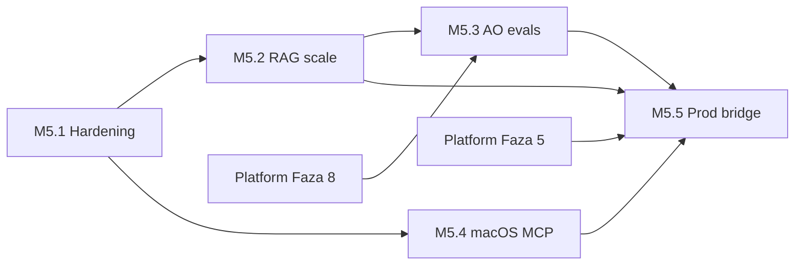

<link rel="stylesheet" href="../styles/main.css">

# Octa Workspace MVP — plan dalszych prac

[← Indeks planowania](README.md) · [Workspace MVP (EN)](../architecture/workspace-mvp.md)

**Status:** roboczy · **2026-06-14** · po zamknięciu Sprint 0–3 + E2E Playwright

Ten dokument rozpisuje **co już jest**, **co domyka MVP M5**, i **kolejne fazy** aż do mostu produkcyjnego (HYDRA / workspace.octadecimal.pro). Szczegóły techniczne uruchomienia: [workspace-mvp.md](../architecture/workspace-mvp.md). Wersja Kanonu: `Knowledge/.../octa-os/mvp-localhost-m5.md`.

---

## Stan na dziś (zamknięte)

→ **[Pełna dokumentacja zamkniętych sprintów (Sprint 0–3 + rozszerzenia)](workspace-mvp-done-index.md)**

| Obszar | Efekt | Weryfikacja | Sprint |
|--------|-------|-------------|--------|
| Boot loop | `./scripts/octa-mvp-up.sh` → `:8042` | UI 200, health OK | [S0](workspace-mvp-sprint-0-boot.md) |
| UI hash | `#Ogolny` … `#Retro` | Nawigacja + brak błędu JS w Review | [S1](workspace-mvp-sprint-1-chat-wiki.md) |
| Chat AO | RAG + heurystyki (`dry`) + MiniMax (BSM) | pytest + E2E | [S1](workspace-mvp-sprint-1-chat-wiki.md), [ext](workspace-mvp-done-extensions.md) |
| Wiki | Hybrid search, cytaty ze ścieżek md | E2E: `Backup.md` | [S1](workspace-mvp-sprint-1-chat-wiki.md) |
| Board | CRUD tasków w `OCTA_LEDGER` | E2E + restart | [S2](workspace-mvp-sprint-2-panels-hitl.md) |
| Planning | Generacja planu, edycja, fixture/`calctl` | E2E | [S2](workspace-mvp-sprint-2-panels-hitl.md), [S3](workspace-mvp-sprint-3-retro-infra.md) |
| Review HITL | Kolejka, badge, approve/reject, attention | E2E + operator | [S2](workspace-mvp-sprint-2-panels-hitl.md), [ext](workspace-mvp-done-extensions.md) |
| Retro | Zapis journal md | E2E | [S3](workspace-mvp-sprint-3-retro-infra.md) |
| RAG dev | Qdrant `:6335`, `embed-knowledge sync --dev` | manifest SHA-256 | [S3](workspace-mvp-sprint-3-retro-infra.md) |
| MCP stub | `list_today_calendar`, `workspace_health` | integration test | [S3](workspace-mvp-sprint-3-retro-infra.md), [ext](workspace-mvp-done-extensions.md) |
| Testy | 110 pytest + 9 Playwright | lokalnie zielone | [ext](workspace-mvp-done-extensions.md) |
| Sekrety | BSM / Keychain dla MiniMax | manual smoke | [ext](workspace-mvp-done-extensions.md) |

---

## Mapa faz (skrót)

**Zamknięte:** [Sprint 0–3 + rozszerzenia](workspace-mvp-done-index.md)

Szczegóły architektury faz otwartych — w osobnych plikach:

| Faza | Skrót | Dokument |
|------|-------|----------|
| [M5.1](workspace-mvp-m5-1-hardening.md) | Hardening MVP | [workspace-mvp-m5-1-hardening.md](workspace-mvp-m5-1-hardening.md) |
| [M5.2](workspace-mvp-m5-2-rag-scale.md) | RAG & Knowledge scale | [workspace-mvp-m5-2-rag-scale.md](workspace-mvp-m5-2-rag-scale.md) |
| [M5.3](workspace-mvp-m5-3-ao-evals.md) | AO & evals | [workspace-mvp-m5-3-ao-evals.md](workspace-mvp-m5-3-ao-evals.md) |
| [M5.4](workspace-mvp-m5-4-macos-mcp.md) | macOS live MCP | [workspace-mvp-m5-4-macos-mcp.md](workspace-mvp-m5-4-macos-mcp.md) |
| [M5.5](workspace-mvp-m5-5-prod-bridge.md) | Most prod / HYDRA | [workspace-mvp-m5-5-prod-bridge.md](workspace-mvp-m5-5-prod-bridge.md) |
| [M6+](workspace-mvp-m6-platform.md) | Platform core | [workspace-mvp-m6-platform.md](workspace-mvp-m6-platform.md) |

```text
M5.1  Hardening MVP          ← teraz (1 tydzień)
M5.2  RAG & Knowledge scale  ← 1–2 tygodnie
M5.3  AO & evals             ← 1–2 tygodnie
M5.4  macOS live MCP         ← 1 tydzień
M5.5  Most prod / HYDRA     ← 2+ tygodnie
M6+   Platform core          ← fazy 5–13 roadmapy platformy
```

Fazy M5.x dotyczą **Workspace na localhost**. Fazy platformy (`docs/planning/phase-*.md`) idą równolegle tam, gdzie wzmacniają jądro (persistence, LangGraph, security, observability).

---

## Faza [M5.1 — Domknięcie MVP (hardening)](workspace-mvp-m5-1-hardening.md)

**Cel:** checklist akceptacji z Kanonu w 100% + CI + stabilność dev.

**Szacunek:** 3–5 dni roboczych.

→ **[Pełny plan: architektura, kroki, ryzyka](workspace-mvp-m5-1-hardening.md)**

| ID | Zadanie | Opis | Done when |
|----|---------|------|-----------|
| M5.1.1 | Checklist akceptacji | Przejść §10 `mvp-localhost-m5.md` i odhaczyć w Kanonie | Wszystkie punkty PASS na czystym M5 |
| M5.1.2 | CI — Playwright E2E | Job w GitHub Actions: `e2e/` + `octa-e2e-server.sh` | PR na main uruchamia 9 scenariuszy |
| M5.1.3 | Idempotentny `seed_demo.py` | Flaga `--reset` lub upsert; brak duplikatów pending | 10× restart → stała liczba w `#Review` |
| M5.1.4 | Panel `#Zasady` | Statyczne linki: OCTA-ZALOZENIA, policy, CONTRIBUTING | Sidebar + placeholder bez RAG |
| M5.1.5 | Placeholdery poza MVP | `#Dev`, `#Burndown`, `#Ranking` — „wkrótce” bez 404 | Klik → komunikat, brak błędu konsoli |
| M5.1.6 | Dokumentacja uruchomienia | README / octa-os: „nowy dev < 15 min” | Kolega odpala bez DM |
| M5.1.7 | Uprawnienia kalendarza | Runbook: System Settings → Calendars dla Terminal/Cursor | `CALENDAR_PROVIDER=auto` zwraca live events |
| M5.1.8 | Health rozszerzony | `/workspace/health`: sync manifest age, LLM provider status | JSON z polami do debugowania |

**Kryterium fazy:** checklist Kanonu ✅ + CI pytest + E2E na każdym pushu do `main`.

---

## Faza [M5.2 — RAG i skala Knowledge](workspace-mvp-m5-2-rag-scale.md)

**Cel:** pewniejsze odpowiedzi AO na pełnym T1, nie tylko ~20 plikach demo.

**Szacunek:** 5–8 dni.

→ **[Pełny plan: pipeline RAG, policy.yaml, re-ranking](workspace-mvp-m5-2-rag-scale.md)**

| ID | Zadanie | Opis | Done when |
|----|---------|------|-----------|
| M5.2.1 | `policy.yaml` T1 | Whitelist globów w `Knowledge/.knowledge-index/` | sync ignoruje T2–T4 |
| M5.2.2 | Pełny ingest T1 | `embed-knowledge sync --dev` na całym core | health: `documents_indexed` >> 77 |
| M5.2.3 | Metryki retrieval | Log score + source w odpowiedzi debug / eval hook | pytest na 5 golden queries |
| M5.2.4 | Re-ranking v2 | Boost path + nagłówki + recency (jeśli metadata) | golden: „backup Qdrant”, „Octa OS”, „HITL” |
| M5.2.5 | Cron / launchd sync | Opcjonalny harmonogram sync co N h | manifest aktualny bez ręcznego sync |
| M5.2.6 | Startup bez pełnego reindex | Już częściowo — dopracować edge cases | `OCTA_REINDEX=0` + pusta kolekcja → jednorazowy ingest |

**Kryterium fazy:** 5 zapytań golden z Kanonu zwraca oczekiwany plik w top-3 (manual + test eval).

---

## Faza [M5.3 — Agent Osobisty (inteligencja + jakość)](workspace-mvp-m5-3-ao-evals.md)

**Cel:** AO mniej „heurystyki”, więcej kontrolowanego reasoning; mierzalna jakość.

**Szacunek:** 5–10 dni.

→ **[Pełny plan: tools, evals, LangGraph spike](workspace-mvp-m5-3-ao-evals.md)**

| ID | Zadanie | Opis | Done when |
|----|---------|------|-----------|
| M5.3.1 | Persona prompt v2 | Maja + Anna: ton PL, krótko, zawsze sugestia hash | review promptów w repo |
| M5.3.2 | Structured tools | `knowledge_search`, `board_list`, `approvals_pending`, `plan_today` jako jawne wywołania | odpowiedź z tool trace (log) |
| M5.3.3 | LangGraph slice (opcjonalnie) | Minimalny graf: retrieve → propose → policy hint | spike + 1 integration test |
| M5.3.4 | Chat eval dataset | 10–15 par pytanie/oczekiwany hash + słowa kluczowe | `tests/evals/workspace_chat.yaml` |
| M5.3.5 | RAG eval dataset | Golden queries + expected sources | eval runner lokalny |
| M5.3.6 | Fallback chain | MiniMax → dry z komunikatem (nie ciche) | health + UI gdy brak tokenu |
| M5.3.7 | Streaming odpowiedzi (nice) | SSE / chunked response w UI | UX bez długiego „martwego” czatu |

**Kryterium fazy:** eval chat ≥ 80% pass lokalnie; brak regresji pytest/E2E.

**Powiązanie z platformą:** [Faza 6 — LangGraph HITL](phase-6-langgraph-hitl-memory.md), [Faza 9 — evals](phase-9-observability-evals-costs.md).

---

## Faza [M5.4 — macOS MCP (live)](workspace-mvp-m5-4-macos-mcp.md)

**Cel:** `#Planning` z prawdziwego kalendarza; fundament pod mail/kontakty.

**Szacunek:** 3–5 dni.

→ **[Pełny plan: calctl, MCP tools, policy read-only](workspace-mvp-m5-4-macos-mcp.md)**

| ID | Zadanie | Opis | Done when |
|----|---------|------|-----------|
| M5.4.1 | `calctl` production path | Auto + cache + fixture fallback udokumentowane | 3 dni testowe na M5 |
| M5.4.2 | MCP — rozszerzenie tools | `board_list`, `wiki_search` (read-only) | Cursor MCP smoke |
| M5.4.3 | Mail stub | Fixture + API shape jak calendar | plan w doc, bez prod IMAP |
| M5.4.4 | Policy na MCP tools | Denied bez approval dla write | test denied path |
| M5.4.5 | Compose MCP (doc only) | Odnośnik do `research/02-macos-automation-mcp.md` | decyzia: stub vs pełny compose |

**Kryterium fazy:** plan dnia zawiera ≥1 wydarzenie live; MCP health w Cursor.

**Powiązanie:** [Faza 10 — MCP](phase-10-mcp-tool-context.md).

---

## Faza [M5.5 — Most produkcyjny (HYDRA / pc-ubuntu)](workspace-mvp-m5-5-prod-bridge.md)

**Cel:** ten sam Kanon i AO poza M5 — bez przepisywania UI.

**Szacunek:** 2–3 tygodnie (z deploy-team).

→ **[Pełny plan: Qdrant prod, auth, backup](workspace-mvp-m5-5-prod-bridge.md)**

| ID | Zadanie | Opis | Done when |
|----|---------|------|-----------|
| M5.5.1 | Push embed → pc-ubuntu | `embed-knowledge push` przez Tailscale → Qdrant `:6333` | query z M5 i z serwera ≈ ten sam wynik |
| M5.5.2 | Kolekcje prod/dev | `knowledge_chunks` vs `knowledge_chunks_dev` | README operacyjny |
| M5.5.3 | Tunel / subdomain | `workspace.octadecimal.pro` → M5 lub VPS | HTTPS smoke |
| M5.5.4 | Auth warstwa | SSO lub basic auth + audit | brak publicznego open CEO |
| M5.5.5 | PostgreSQL path | Migracja z SQLite dev (ledger + approvals) | ADR + spike [Faza 5](phase-5-async-persistence-audit.md) |
| M5.5.6 | Backup & restore | Ledger + Qdrant snapshot runbook | ćwiczenie na pc-ubuntu |

**Kryterium fazy:** CEO może użyć Workspace przez VPN/subdomain z prod RAG.

---

## Faza [M6+ — Platforma (równoległa ścieżka)](workspace-mvp-m6-platform.md)

Workspace MVP nie zastępuje roadmapy platformy.

→ **[Pełny plan: mapowanie faz 5–13, P1/P2/P3](workspace-mvp-m6-platform.md)**

| Priorytet | Faza platformy | Dlaczego teraz |
|-----------|----------------|----------------|
| P1 | [5 — Persistence](phase-5-async-persistence-audit.md) | Review + Board poza SQLite dev |
| P1 | [8 — AI Security](phase-8-ai-security-prompt-injection.md) | RAG + chat = injection surface |
| P2 | [6 — LangGraph HITL](phase-6-langgraph-hitl-memory.md) | Resume workflow po approve |
| P2 | [9 — Observability](phase-9-observability-evals-costs.md) | Koszt MiniMax, latency |
| P3 | [13 — Portfolio polish](phase-13-portfolio-polish.md) | Demo dla rekrutacji |

---

## Backlog UX (poza krytyczną ścieżką)

| ID | Zadanie | Uwagi |
|----|---------|-------|
| UX.1 | Design system (Figma → CSS) | parity z workspace.octadecimal.pro |
| UX.2 | Drag-and-drop na `#Board` | dziś: select status |
| UX.3 | Mobile / responsywność | sidebar collapse |
| UX.4 | Push / Shortcuts M1 | po stabilnym API |
| UX.5 | Głos AO | Ollama / Whisper lokalnie |
| UX.6 | `#Dev`, `#Burndown`, `#Ranking` | wymaga integracji git/CRM |

---

## Zależności między zadaniami



---

## Definition of Done (zadanie)

Każde zadanie z tabel uznajemy za ukończone, gdy:

1. Kod + testy (unit/integration/E2E — w zależności od zakresu).
2. Aktualizacja [workspace-mvp.md](../architecture/workspace-mvp.md) lub tego pliku (status zadania).
3. Brak regresji: `uv run pytest` i `cd e2e && npm test`.
4. Commit z sensownym „why” (CONTRIBUTING).

---

## Proponowana kolejność na najbliższy tydzień

1. **M5.1.2** — CI Playwright (największy zwrot: ochrona regresji).
2. **M5.1.3** — idempotentny seed (ból codzienny z badge Review).
3. **M5.1.1** — formalny sign-off checklisty Kanonu.
4. **M5.1.4 + M5.1.5** — `#Zasady` + placeholdery (domknięcie UX MVP).
5. **M5.2.1 + M5.2.2** — policy T1 + pełny sync (jakość odpowiedzi AO).

---

## Śledzenie postępu

| Faza | Status | Data start | Data koniec | Szczegóły |
|------|--------|------------|-------------|-----------|
| [Sprint 0–3 + ext](workspace-mvp-done-index.md) MVP core | ✅ done | 2026-06 | 2026-06-14 | [indeks](workspace-mvp-done-index.md) · [S0](workspace-mvp-sprint-0-boot.md) · [S1](workspace-mvp-sprint-1-chat-wiki.md) · [S2](workspace-mvp-sprint-2-panels-hitl.md) · [S3](workspace-mvp-sprint-3-retro-infra.md) · [ext](workspace-mvp-done-extensions.md) |
| [M5.1](workspace-mvp-m5-1-hardening.md) Hardening | 🔲 todo | | | [plan](workspace-mvp-m5-1-hardening.md) |
| [M5.2](workspace-mvp-m5-2-rag-scale.md) RAG scale | 🔲 todo | | | [plan](workspace-mvp-m5-2-rag-scale.md) |
| [M5.3](workspace-mvp-m5-3-ao-evals.md) AO evals | 🔲 todo | | | [plan](workspace-mvp-m5-3-ao-evals.md) |
| [M5.4](workspace-mvp-m5-4-macos-mcp.md) macOS MCP | 🔲 todo | | | [plan](workspace-mvp-m5-4-macos-mcp.md) |
| [M5.5](workspace-mvp-m5-5-prod-bridge.md) Prod bridge | 🔲 todo | | | [plan](workspace-mvp-m5-5-prod-bridge.md) |
| [M6+](workspace-mvp-m6-platform.md) Platform | 🔲 todo | | | [plan](workspace-mvp-m6-platform.md) |

*Aktualizuj tabelę po zamknięciu każdej fazy.*

---

## Powiązane dokumenty

- [Workspace MVP — architektura EN](../architecture/workspace-mvp.md)
- [E2E README](../../e2e/README.md)
- [Roadmapa platformy](roadmap-draft.md)
- Kanon Octa OS: `Knowledge/01-Base-Point/pro/projects/octa-os/mvp-localhost-m5.md`

### Plany faz Workspace MVP

**Zamknięte (Sprint 0–3):**

- [Indeks zamkniętych prac](workspace-mvp-done-index.md)
- [Sprint 0 — Boot loop](workspace-mvp-sprint-0-boot.md)
- [Sprint 1 — Chat + Wiki](workspace-mvp-sprint-1-chat-wiki.md)
- [Sprint 2 — Board, Planning, Review](workspace-mvp-sprint-2-panels-hitl.md)
- [Sprint 3 — Retro + infra RAG/kalendarz](workspace-mvp-sprint-3-retro-infra.md)
- [Rozszerzenia po Sprint 3](workspace-mvp-done-extensions.md)

**Otwarte (M5.x):**
- [M5.2 — RAG scale](workspace-mvp-m5-2-rag-scale.md)
- [M5.3 — AO & evals](workspace-mvp-m5-3-ao-evals.md)
- [M5.4 — macOS MCP](workspace-mvp-m5-4-macos-mcp.md)
- [M5.5 — Prod bridge](workspace-mvp-m5-5-prod-bridge.md)
- [M6+ — Platforma](workspace-mvp-m6-platform.md)
