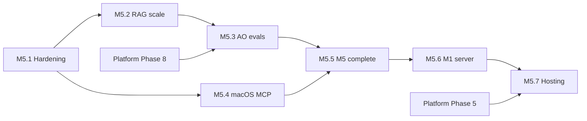

<link rel="stylesheet" href="../styles/main.css">

# Octa Workspace MVP — roadmap

[← Planning index](README.md) · [Workspace MVP architecture](../architecture/workspace-mvp.md)

**Status:** active · **2026-06-15** · M5.5 dev loop complete

This document tracks **what is done**, **what completes the M5-only dev loop**, and **later phases** (M1 server mode, deferred Ubuntu hosting). Runtime details: [workspace-mvp.md](../architecture/workspace-mvp.md). Kanon (PL): `Knowledge/.../octa-os/mvp-localhost-m5.md`. Strategy: [ADR 006](../adr/006-m5-only-dev-strategy.md).

---

## Strategic pivot (2026-06-15)

Development stays **M5-only** until the local loop is complete. We do **not** integrate with legacy Ubuntu dev-teams or HYDRA orchestration next.

| Direction | Decision |
|-----------|----------|
| **Now** | M5 dev loop complete — daily use on localhost |
| **Next** | [M5.6](workspace-mvp-m5-6-m1-server-mode.md) — M1 server mode (agents 24/7 on Mac) |
| **Deferred** | [M5.7](workspace-mvp-m5-7-hosting-only.md) — pc-ubuntu hosting only (backup, HTTPS); no agent fleet |
| **Parallel** | [M6+ platform](workspace-mvp-m6-platform.md) — phases 5–13 of the core platform |

**Explicitly deferred:** `embed-knowledge sync --prod`, HYDRA fleet integration, `#Dev` / git / CRM panels (UX.6).

---

## Current state (closed)

→ **[Full documentation for Sprint 0–3 + extensions](workspace-mvp-done-index.md)**

| Area | Outcome | Verification | Sprint |
|------|---------|--------------|--------|
| Boot loop | `./scripts/octa-mvp-up.sh` → `:8042` | UI 200, health OK | [S0](workspace-mvp-sprint-0-boot.md) |
| UI hash | `#Ogolny` … `#Retro` | Navigation + no JS errors in Review | [S1](workspace-mvp-sprint-1-chat-wiki.md) |
| Chat AO | RAG + heuristics (`dry`) + MiniMax (BSM) | pytest + E2E | [S1](workspace-mvp-sprint-1-chat-wiki.md), [ext](workspace-mvp-done-extensions.md) |
| Wiki | Hybrid search, citations from md paths | E2E: `Backup.md` | [S1](workspace-mvp-sprint-1-chat-wiki.md) |
| Board | CRUD tasks in `OCTA_LEDGER` | E2E + restart | [S2](workspace-mvp-sprint-2-panels-hitl.md) |
| Planning | Plan generation, edit, fixture/`calctl` | E2E | [S2](workspace-mvp-sprint-2-panels-hitl.md), [S3](workspace-mvp-sprint-3-retro-infra.md) |
| Review HITL | Queue, badge, approve/reject, attention | E2E + operator | [S2](workspace-mvp-sprint-2-panels-hitl.md), [ext](workspace-mvp-done-extensions.md) |
| Retro | Journal md write | E2E | [S3](workspace-mvp-sprint-3-retro-infra.md) |
| RAG dev | Qdrant `:6335`, `embed-knowledge sync --dev` | manifest SHA-256 | [S3](workspace-mvp-sprint-3-retro-infra.md) |
| MCP | Read-only tools + calendar | integration test | [S3](workspace-mvp-sprint-3-retro-infra.md), [M5.4](workspace-mvp-m5-4-macos-mcp.md) |
| Tests | 164 pytest + E2E | green locally + CI | [ext](workspace-mvp-done-extensions.md) |

---

## Phase map

**Closed:** [Sprint 0–3 + extensions](workspace-mvp-done-index.md)

| Phase | Summary | Document |
|-------|---------|----------|
| [M5.1](workspace-mvp-m5-1-hardening.md) | MVP hardening | ✅ done |
| [M5.2](workspace-mvp-m5-2-rag-scale.md) | RAG & Knowledge scale | ✅ done |
| [M5.3](workspace-mvp-m5-3-ao-evals.md) | AO & evals | ✅ done (M5.3.3/7 skipped) |
| [M5.4](workspace-mvp-m5-4-macos-mcp.md) | macOS live MCP | ✅ done |
| [M5.5](workspace-mvp-m5-5-m5-complete.md) | Complete M5 dev loop | ✅ done |
| [M5.6](workspace-mvp-m5-6-m1-server-mode.md) | M1 server mode | 🔲 next |
| [M5.7](workspace-mvp-m5-7-hosting-only.md) | Ubuntu hosting only | ⏸ deferred |
| [M6+](workspace-mvp-m6-platform.md) | Platform core | 🔲 parallel |

```text
M5.1  Hardening MVP          ✅ 2026-06-15
M5.2  RAG & Knowledge scale  ✅ 2026-06-15
M5.3  AO & evals             ✅ 2026-06-15
M5.4  macOS live MCP         ✅ 2026-06-15
M5.5  M5 dev loop complete   ✅ 2026-06-15
M5.6  M1 server mode        ← next
M5.7  Ubuntu hosting only   ← deferred (no HYDRA agents)
M6+   Platform core          ← parallel with M5.x
```

M5.x phases target **Workspace on localhost**. Platform phases (`docs/planning/phase-*.md`) run in parallel where they strengthen the kernel (persistence, LangGraph, security, observability).

---

## Phase summaries

### [M5.1 — MVP hardening](workspace-mvp-m5-1-hardening.md) ✅

Checklist sign-off, CI Playwright, idempotent seed, `#Zasady`, extended health, calendar runbook.

### [M5.2 — RAG & Knowledge scale](workspace-mvp-m5-2-rag-scale.md) ✅

`policy.yaml` T1, full ingest, retrieval metrics, re-ranking v2, launchd sync, startup edge cases.

### [M5.3 — Personal Agent quality](workspace-mvp-m5-3-ao-evals.md) ✅

Persona v2, structured tools, eval datasets, explicit dry fallback. Skipped: LangGraph spike (M5.3.3), streaming (M5.3.7).

### [M5.4 — macOS live MCP](workspace-mvp-m5-4-macos-mcp.md) ✅

`calctl` production path, MCP read-only tools (`wiki_search`, `board_list_tasks`, `review_pending_summary`), mail stub, [ADR 002](../adr/002-mcp-compose-strategy.md).

### [M5.5 — Complete M5 dev loop](workspace-mvp-m5-5-m5-complete.md) ✅

Runbook, launchd API, Octa-native board teams, Kanon sign-off v2. [Sign-off](workspace-mvp-m5-5-signoff.md).

### [M5.6 — M1 server mode](workspace-mvp-m5-6-m1-server-mode.md) 🔲

Always-on agents on M1 Mac; Workspace API reachable from daily driver without manual `octa-mvp-up.sh`.

### [M5.7 — Ubuntu hosting only](workspace-mvp-m5-7-hosting-only.md) ⏸

Prod Qdrant backup, HTTPS subdomain, auth — **hosting layer only**. No HYDRA agent orchestration or legacy Ubuntu team integration.

### [M6+ — Platform (parallel)](workspace-mvp-m6-platform.md)

Phases 5–13: PostgreSQL, AI security, LangGraph HITL, observability, portfolio polish.

---

## UX backlog (non-critical)

| ID | Task | Notes |
|----|------|-------|
| UX.1 | Design system (Figma → CSS) | parity with workspace.octadecimal.pro |
| UX.2 | Drag-and-drop on `#Board` | today: select status |
| UX.3 | Mobile / responsive | sidebar collapse |
| UX.4 | Push / Shortcuts M1 | after stable API (M5.6) |
| UX.5 | Voice AO | Ollama / Whisper locally |
| UX.6 | `#Dev`, `#Burndown`, `#Ranking` | **deferred** — needs git/CRM integration |

---

## Dependencies



---

## Definition of Done (per task)

1. Code + tests (unit/integration/E2E as appropriate).
2. Update [workspace-mvp.md](../architecture/workspace-mvp.md) or this file (task status).
3. No regressions: `uv run pytest` and `cd e2e && npm test`.
4. Commit with a clear “why” (CONTRIBUTING).

---

## Progress tracking

| Phase | Status | Start | End | Details |
|-------|--------|-------|-----|---------|
| [Sprint 0–3 + ext](workspace-mvp-done-index.md) MVP core | ✅ done | 2026-06 | 2026-06-14 | [index](workspace-mvp-done-index.md) |
| [M5.1](workspace-mvp-m5-1-hardening.md) Hardening | ✅ done | 2026-06-15 | 2026-06-15 | [sign-off](workspace-mvp-m5-1-signoff.md) |
| [M5.2](workspace-mvp-m5-2-rag-scale.md) RAG scale | ✅ done | 2026-06-15 | 2026-06-15 | [plan](workspace-mvp-m5-2-rag-scale.md) |
| [M5.3](workspace-mvp-m5-3-ao-evals.md) AO evals | ✅ done | 2026-06-15 | 2026-06-15 | [plan](workspace-mvp-m5-3-ao-evals.md) |
| [M5.4](workspace-mvp-m5-4-macos-mcp.md) macOS MCP | ✅ done | 2026-06-15 | 2026-06-15 | [plan](workspace-mvp-m5-4-macos-mcp.md) |
| [M5.5](workspace-mvp-m5-5-m5-complete.md) M5 complete | ✅ done | 2026-06-15 | 2026-06-15 | [sign-off](workspace-mvp-m5-5-signoff.md) |
| [M5.6](workspace-mvp-m5-6-m1-server-mode.md) M1 server | 🔲 todo | | | [plan](workspace-mvp-m5-6-m1-server-mode.md) |
| [M5.7](workspace-mvp-m5-7-hosting-only.md) Hosting | ⏸ deferred | | | [plan](workspace-mvp-m5-7-hosting-only.md) |
| [M6+](workspace-mvp-m6-platform.md) Platform | 🔲 parallel | | | [plan](workspace-mvp-m6-platform.md) |

*Update this table when closing each phase.*

---

## Related documents

- [Workspace MVP architecture](../architecture/workspace-mvp.md)
- [ADR 006 — M5-only dev strategy](../adr/006-m5-only-dev-strategy.md)
- [E2E README](../../e2e/README.md)
- [Platform roadmap](roadmap-draft.md)
- Kanon (PL): `Knowledge/01-Base-Point/pro/projects/octa-os/mvp-localhost-m5.md`

### Closed (Sprint 0–3)

- [Done work index](workspace-mvp-done-index.md)
- [Sprint 0 — Boot loop](workspace-mvp-sprint-0-boot.md)
- [Sprint 1 — Chat + Wiki](workspace-mvp-sprint-1-chat-wiki.md)
- [Sprint 2 — Board, Planning, Review](workspace-mvp-sprint-2-panels-hitl.md)
- [Sprint 3 — Retro + RAG/calendar infra](workspace-mvp-sprint-3-retro-infra.md)
- [Post–Sprint 3 extensions](workspace-mvp-done-extensions.md)

### Closed (M5.x)

- [M5.5 — M5 dev loop complete](workspace-mvp-m5-5-m5-complete.md) · [sign-off](workspace-mvp-m5-5-signoff.md)

### Open (M5.x)

- [M5.6 — M1 server mode](workspace-mvp-m5-6-m1-server-mode.md)
- [M5.7 — Ubuntu hosting only](workspace-mvp-m5-7-hosting-only.md)
- [M6+ — Platform](workspace-mvp-m6-platform.md)

**Superseded:** [M5.5 prod bridge (old)](workspace-mvp-m5-5-prod-bridge.md) — replaced by M5.5 + M5.7 split.
