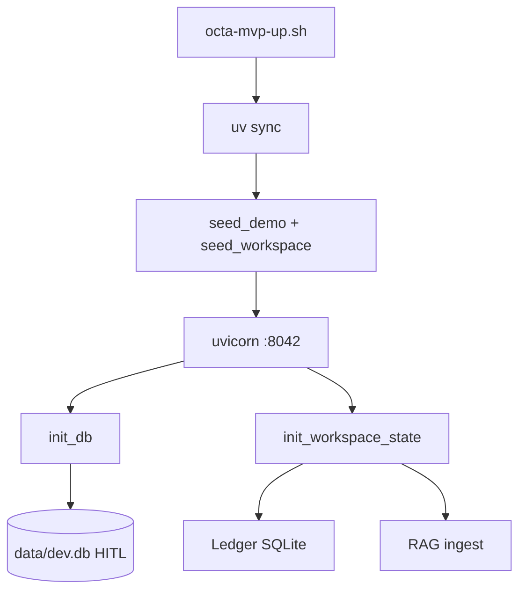

<link rel="stylesheet" href="../styles/main.css">

# Sprint 0 — Boot loop (zamknięty)

[← Indeks zamkniętych prac](workspace-mvp-done-index.md) · [Workspace MVP roadmap](workspace-mvp-roadmap.md)

**Status:** ✅ done · **2026-06** · commity: `4e58358`, `2526053`

## Cel sprintu (Kanon)

Jedna komenda uruchamia stack; pusta UI odpowiada; health OK; ledger i seed HITL istnieją; pierwszy ingest Knowledge zwraca sensowne wyniki dla „backup”.

---

## Zrealizowane zadania

| ID | Zadanie | Done when (Kanon) | Status |
|----|---------|-------------------|--------|
| 0.1 | `octa-mvp-up.sh` | `curl localhost:8042` → 200 | ✅ |
| 0.2 | Schema ledger SQLite | tabele tasks, plan_items | ✅ |
| 0.3 | Seed approvals + demo | widoczne w `/operator/` | ✅ |
| 0.4 | Ingest T1 do RAG | `backup` → Backup.md | ✅ |

---

## Architektura uruchomienia

### Jeden proces na `:8042`

Pierwotny plan Kanonu przewidywał porty `:8000` + `:8042`. **Decyzja implementacyjna:** jeden uvicorn serwuje UI, Workspace API, Operator i `/actions` — mniej mylące dla CEO.

```bash
./scripts/octa-mvp-up.sh
# WORKSPACE_ENABLED=1
# exec uvicorn ... --port 8042
```

### Wpięcie w FastAPI

```python
# adapters/api/app.py
if config.enabled:
    app.include_router(workspace_router)
    app.get("/") → index.html
    app.mount("/static", StaticFiles)
```

`WORKSPACE_ENABLED=0` (domyślnie) — tylko jądro governance bez UI Workspace.

### Lifecycle stanu

```text
lifespan startup
    init_db()                    # SQLAlchemy async — approvals DB
    init_workspace_state()
        WorkspaceLedger(path)    # ~/.octa/ledger.sqlite
        seed_demo_tasks()        # 3 przykładowe taski board
        vector store + ingest    # memory lub qdrant
```

Moduł: `infrastructure/workspace/state.py` — singletony dev-friendly (jeden proces).

---

## 0.1 — Skrypt `octa-mvp-up.sh`

**Rozwiązanie:**

- `uv sync` przed startem
- Env defaults: `KNOWLEDGE_ROOT`, `OCTA_LEDGER`, `LLM_PROVIDER=dry`, `RAG_BACKEND=memory`
- Auto-load `BWS_ACCESS_TOKEN` z Keychain (`pl.octadecimal.m1-runtime.BWS_ACCESS_TOKEN`)
- Opcjonalnie: `octa-qdrant-dev.sh` gdy `RAG_BACKEND=qdrant`
- Seed: `seed_demo.py` + `seed_workspace_mvp.py`

**Pliki:** `scripts/octa-mvp-up.sh`

---

## 0.2 — Ledger SQLite

**Schema** (`infrastructure/workspace/ledger.py`):

```sql
tasks (id, team, status, title, intent, created_at, updated_at)
plan_items (id, plan_date, sort_order, title, source)
```

**Koncepcja:** ledger to **osobna baza** od approvals (`data/dev.db`). CEO tablica i plan nie mieszają się z modelem domeny HITL — adapter persistence, nie nowa domena.

**API init:** `WorkspaceLedger` tworzy tabele przy pierwszym użyciu (`CREATE IF NOT EXISTS`).

---

## 0.3 — Seed demo

**`scripts/seed_demo.py`:**

- 3× `ApprovalRequest` (WRITE_FILE, RUN_COMMAND, SEND_NOTIFICATION)
- Audit events powiązane
- Baza: `data/dev.db` (lub `DATABASE_URL` — dodane później dla E2E)

**`scripts/seed_workspace_mvp.py`:**

- Plan na dziś: 4 pozycje (ao + calendar source tag)

**Uwaga znana:** seed nie jest idempotentny — każdy restart dodaje pending. Naprawa → [M5.1.3](workspace-mvp-m5-1-hardening.md).

---

## 0.4 — Pierwszy ingest RAG

**Pipeline:**

```text
knowledge_scan.py     → lista plików T1 pod KNOWLEDGE_ROOT
markdown_clean.py     → strip HTML callouts
knowledge_loader.py   → chunk + FakeEmbeddingProvider
InMemoryVectorStore   → upsert (domyślnie)
```

**Globs:** m.in. `01-Base-Point/**`, operacje serwer — szczegóły w `knowledge_scan.py`.

**Weryfikacja:** `/workspace/wiki/search?q=backup` lub chat „jak backup Qdrant?”.

---

## Diagram



---

## Testy dostarczone

- `tests/integration/test_workspace_mvp.py` — health, chat, wiki
- `tests/unit/infrastructure/test_workspace_ledger.py` — CRUD ledger

---

## Odchylenia od Kanonu

| Kanon | Implementacja | Powód |
|-------|---------------|-------|
| Port 8000 + 8042 | Tylko 8042 | jeden URL dla CEO |
| ~20 plików ingest | pełniejszy glob T1 | skaner rozszerzalny |
| Ollama | dry + MiniMax/DeepSeek później | BSM + API first |

---

## Powiązane commity

- `4e58358` — feat(workspace): add local Octa Workspace MVP and marketing site
- `2526053` — feat(workspace): add Qdrant RAG backend, hybrid search, and planning
