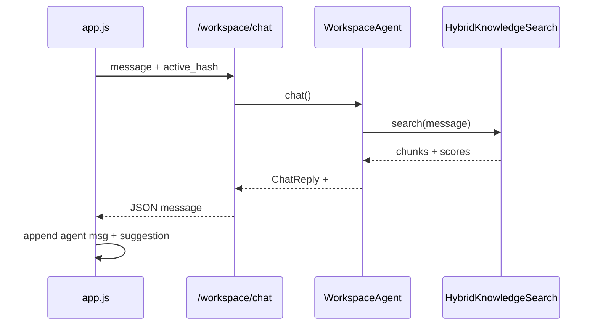

<link rel="stylesheet" href="../styles/main.css">

# Sprint 1 — Chat + Wiki (zamknięty)

[← Indeks zamkniętych prac](workspace-mvp-done-index.md) · [Sprint 0](workspace-mvp-sprint-0-boot.md)

**Status:** ✅ done · **2026-06** · commity: `4e58358`, `2526053`, `adde008`

## Cel sprintu (Kanon)

Layout chat + sidebar hash; AO odpowiada z cytatem Knowledge; panel `#Wiki` z wyszukiwaniem; tryb suchy bez klucza API dla CI.

---

## Zrealizowane zadania

| ID | Zadanie | Done when | Status |
|----|---------|-----------|--------|
| 1.1 | UI layout + sidebar hash | `#Wiki` działa | ✅ |
| 1.2 | `POST /workspace/chat` | cytat ścieżki w odpowiedzi | ✅ |
| 1.3 | Panel `#Wiki` | wyniki ze score | ✅ |
| 1.4 | Tryb dry | pytest bez API key | ✅ |

---

## Architektura UI

### Vanilla JS, bez bundlera

**Decyzja:** statyczne pliki pod FastAPI `StaticFiles` — zero Node w dev loop CEO, szybki iteration na M5.

| Plik | Rola |
|------|------|
| `static/index.html` | 6 paneli hash + chat sticky |
| `static/app.js` | routing hash, fetch API, loadPanelData |
| `static/styles.css` | layout sidebar + chat (ciemny motyw MVP) |

### Nawigacja hash

```javascript
function setHash(hash) {
  activeHash = hash;
  location.hash = hash.slice(1);
  // toggle .active on .nav-link and .panel
  loadPanelData(hash);
}
```

Panele: `#Ogolny`, `#Planning`, `#Board`, `#Wiki`, `#Review`, `#Retro`.

Chat zawsze widoczny na dole — `active_hash` wysyłany w `POST /workspace/chat` dla kontekstu.

---

## Architektura chat AO

### WorkspaceAgent (`application/workspace_agent.py`)

**Warstwa application** — orchestracja bez FastAPI:

```text
POST /workspace/chat { message, active_hash }
        │
        ▼
WorkspaceAgent.chat()
        ├── słowa kluczowe (plan, blocked, attention, review)
        ├── _search() → HybridKnowledgeSearch / RetrieveContextUseCase
        ├── _try_llm_reply() → opcjonalny LLM
        └── ChatReply { message, suggested_hash, citations }
```

**Tryb dry (`LLM_PROVIDER=dry`):**

- `build_chat_provider` zwraca provider z `is_available() == False`
- Agent składa odpowiedź z chunków RAG + szablony
- Przykład: excerpt z Kanonu + `→ #Wiki`

### Hybrid search (`infrastructure/workspace/hybrid_search.py`)

**Problem:** czysty vector search z `FakeEmbeddingProvider` słabo rankuje „backup Qdrant” vs stuby agentów.

**Rozwiązanie:** re-rank po retrieval:

```text
final_score = vector_score + path_token_boost(source, query)
```

Commit `adde008` — `Backup.md` nad stubami w Wiki.

---

## 1.2 — Endpoint chat

**Router:** `adapters/workspace/router.py`

```python
@router.post("/chat")
async def workspace_chat(body: ChatRequest, session) -> ChatResponse:
    pending = pending_review_items(await repo.list_pending())
    agent = WorkspaceAgent(ledger, search, chat, pending_reviews=pending)
    reply = await agent.chat(body.message, body.active_hash)
```

**Schema:** `ChatRequest`, `ChatResponse` w `schemas.py`.

UI appenduje sugestię hash: „Sugestia: otwórz #Wiki”.

---

## 1.3 — Panel Wiki

**API:** `GET /workspace/wiki/search?q=...`

Zwraca listę `{ source, excerpt, score }` — render w `#wiki-results`.

**Formularz:** `#wiki-form` → `loadWiki(query)`.

---

## 1.4 — Testy bez LLM

| Test | Plik |
|------|------|
| Agent heurystyki | `tests/unit/application/test_workspace_agent.py` |
| Integration MVP | `tests/integration/test_workspace_mvp.py` |
| Hybrid search | unit po `adde008` |

CI (`python-quality.yml`): `uv run pytest` — bez sekretów LLM.

---

## Diagram przepływu chat (dry)



---

## Rozszerzenia poza Sprint 1 (patrz też extensions doc)

- MiniMax / DeepSeek LLM — pełne odpowiedzi RAG+LLM
- `sanitize_llm_reply` — filtrowanie thinking blocks
- Review attention summaries w chacie

---

## Powiązane commity

- `4e58358` — UI + pierwszy chat
- `2526053` — hybrid search, planning hooks
- `adde008` — fix ranking Backup.md
