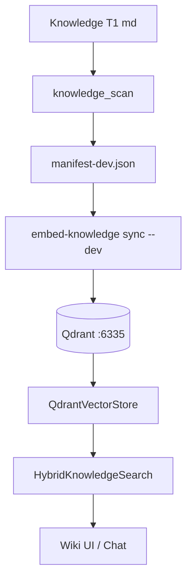

<link rel="stylesheet" href="../styles/main.css">

# Sprint 3 — Retro + infrastruktura RAG/kalendarz (zamknięty)

[← Indeks zamkniętych prac](workspace-mvp-done-index.md) · [Sprint 2](workspace-mvp-sprint-2-panels-hitl.md)

**Status:** ✅ done · **2026-06** · commity: `2526053`, `b10f7bf`, `cafaae4`

## Cel sprintu (Kanon)

Formularz retro → journal md; Docker Qdrant dev; fixture kalendarza w Planning; dokumentacja uruchomienia.

---

## Zrealizowane zadania

| ID | Zadanie | Done when | Status |
|----|---------|-----------|--------|
| 3.1 | `#Retro` → journal | plik md na dziś | ✅ |
| 3.2 | Qdrant `:6335` + sync dev | query jak in-memory | ✅ |
| 3.3 | Fixture kalendarza | wydarzenia w Planning | ✅ |
| 3.4 | Dokumentacja | nowy dev < 15 min | ⚠️ częściowo — [M5.1.6](workspace-mvp-m5-1-hardening.md) |

---

## 3.1 — Retro journal

### API

```text
GET  /workspace/retro/today   → { path, content }
POST /workspace/retro          → { went_well, improve, tomorrow }
```

**Format pliku** (markdown):

```markdown
# Retro — YYYY-MM-DD
_Updated HH:MM UTC_
## Co poszło dobrze
...
## Co poprawić
...
## Jutro
...
```

### Konfiguracja ścieżki

`WorkspaceConfig.journal_dir` — domyślnie pod `OCTA_STATE_DIR` / rozszerzenie config.

**Odchylenie od Kanonu:** Kanon wskazuje `Knowledge/02-6-Rooms-Model/_system/journal/`; implementacja używa konfigurowalnego `journal_dir` (env) — łatwiejsze na M5 bez zapisu w repo Knowledge.

### UI

- `#retro-form` — trzy pola + submit
- `#retro-preview` — `loadRetro()` po zapisie

---

## 3.2 — Qdrant dev + sync

### Docker Qdrant

**Skrypt:** `scripts/octa-qdrant-dev.sh`  
**Compose:** `docker-compose.qdrant-dev.yml`  
**Port:** `6335` (REST) — unika konfliktu z prod `:6333` na pc-ubuntu.

### Backend RAG

```python
# state.py
if config.rag_backend == "qdrant":
    QdrantVectorStore(url, collection="knowledge_chunks_dev")
else:
    InMemoryVectorStore()
```

**Startup logic:**

- `ensure_collection()`
- Jeśli `count_points == 0` lub `OCTA_REINDEX=1` → full ingest
- Inaczej — reuse istniejącej kolekcji

### Incremental sync (`b10f7bf`)

**CLI:** `scripts/embed-knowledge.py`

```bash
uv run python scripts/embed-knowledge.py sync --dev
uv run python scripts/embed-knowledge.py sync --dev --dry-run
```

**Moduły:**

- `knowledge_scan.py` — skan + SHA-256
- `knowledge_sync.py` — diff manifestu, upsert/delete points
- Manifest: `KNOWLEDGE_ROOT/.knowledge-index/manifest-dev.json`

**Koncepcja:** ingest przy starcie uvicorn to **bootstrap**; codzienna aktualizacja przez sync CLI (launchd → M5.2.5).

---

## 3.3 — Kalendarz fixture + calctl

### Provider warstwowy

`infrastructure/macos/calendar_provider.py`:

| `CALENDAR_PROVIDER` | Zachowanie |
|---------------------|------------|
| `fixture` | JSON z `OCTA_CALENDAR_FIXTURE` |
| `macos` | EventKit przez `calctl` |
| `auto` | macos → cache → fixture |

**Cache:** `~/.octa/calendar-cache.json` — ten sam dzień.

### Sprint 3 scope

- Fixture JSON dla CI/E2E (`octa-e2e-server.sh`)
- Integracja z `#Planning` — blok „Źródło kalendarza: …”

### Rozszerzenie `cafaae4`

- MCP `list_today_calendar`
- `scripts/octa-mcp-workspace.sh`
- `docs/architecture/mcp-workspace.example.json`

---

## Diagram RAG dev



---

## Dokumentacja (3.4)

**Dostarczone:**

- [workspace-mvp.md](../architecture/workspace-mvp.md) — EN, env, Qdrant, MiniMax
- Kanon cross-link w Knowledge

**Brakuje do pełnego 3.4:**

- Skrócony quick start w root README → M5.1.6

---

## Testy

- `tests/unit/infrastructure/test_knowledge_sync.py`
- `tests/unit/infrastructure/test_knowledge_sync_integration.py`
- `tests/unit/infrastructure/test_calendar_provider.py`
- `tests/integration/test_workspace_mcp.py`

---

## Powiązane commity

- `2526053` — Qdrant backend, retro, planning calendar hook
- `b10f7bf` — incremental embed-knowledge sync
- `cafaae4` — macOS calendar MCP stub via calctl
