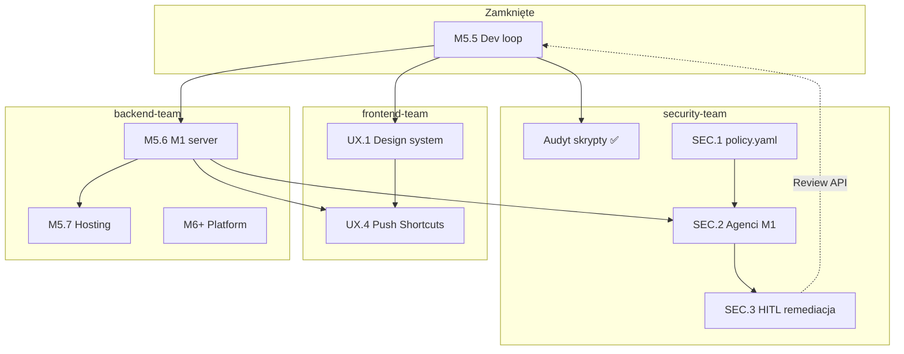

<link rel="stylesheet" href="../styles/main.css">

# Octa Workspace — triple-track: backend · frontend · security

[← Planning index](README.md) · [Roadmap](workspace-mvp-roadmap.md) · [Architektura](../architecture/workspace-mvp.md) · [ADR 006](../adr/006-m5-only-dev-strategy.md)

**Status:** active · **2026-06-15** · **Właściciel kontraktu:** backend-team + frontend-team + security-team

Ten dokument opisuje **trzy równoległe wątki pracy** nad Octa Workspace i operacjami infra:

| Zespół | Zakres | Plan szczegółowy |
|--------|--------|------------------|
| **backend-team** | API, infra, M1/M5, platforma M6+ | [workspace-team-backend-plan.md](workspace-team-backend-plan.md) |
| **frontend-team** | UX/UI, design system | [workspace-team-frontend-plan.md](workspace-team-frontend-plan.md) |
| **security-team** | Audyt, remediacja, HITL ops (M1 → pc-ubuntu) | [workspace-team-security-plan.md](workspace-team-security-plan.md) |

Kanon PL (CEO): `Knowledge/01-Base-Point/pro/projects/octa-os/triple-track-zespoly.md`  
**Dashboard postępu (CEO):** `Knowledge/01-Base-Point/pro/projects/octa-os/triple-track-dashboard.md` — paski, bramki SYNC, oś czasu; każdy zespół aktualizuje własną sekcję (reguły w promptach inicjacyjnych).

> **Migracja:** poprzedni [dual-track](workspace-mvp-dual-track.md) → ten dokument (dodany **security-team**).

---

## 1. Model triple-track

```text
┌──────────────────────┐  ┌──────────────────────┐  ┌──────────────────────┐
│   backend-team       │  │   frontend-team      │  │   security-team      │
│   Cursor · M5/M1     │  │   OpenCode · WDS     │  │   Cursor · M1 24/7   │
├──────────────────────┤  ├──────────────────────┤  ├──────────────────────┤
│ M5.6 M1 server       │  │ UX.1 design system   │  │ M5.8 Security Ops    │
│ M5.7 hosting (def.)  │  │ UX.2–UX.5            │  │ Lynis → HITL → exec  │
│ M6+ platform         │  │ static/, artifacts   │  │ scripts/, policy     │
│ router, launchd      │  │                      │  │ pc-ubuntu remote     │
│ feat/m5-*            │  │ feat/ux-*            │  │ feat/sec-*           │
└──────────┬───────────┘  └──────────┬───────────┘  └──────────┬───────────┘
           │                         │                         │
           └─────────────────────────┴─────────────────────────┘
                         git + markdown = SSOT
                         merge tylko PR + zielone CI
```

**Zasada nadrzędna:** stan projektu = **repozytorium + pliki markdown**, nie pamięć sesji agenta.

**Nie mylić z:** slugami tablicy Board (`platform`, `knowledge`, `ops`, `product`) — to kategorie produktowe Octa, nie zespoły dev.

---

## 2. Role węzłów

| Węzeł | backend-team | frontend-team | security-team |
|-------|--------------|---------------|---------------|
| **M5** | Dev/build, pytest, CI | Podgląd UI lokalnie | Dev polityk, evals |
| **M1** | launchd Workspace 24/7 | UX.4 po M5.6 | **Orkiestracja** agentów security |
| **pc-ubuntu** | M5.7 hosting (deferred) | — | **Cel remediacji** (SSH + allowlist) |

---

## 3. Punkty synchronizacji między zespołami

Synchronizacja = moment, w którym zespoły **muszą uzgodnić wspólny kontrakt** przed dalszą pracą.

### 3.1 Macierz zależności

| Sync ID | Kiedy | Dostawca → Konsument | Artefakt |
|---------|-------|----------------------|----------|
| **SYNC-API** | Nowy/zmieniony endpoint | backend → frontend, security | [workspace-mvp.md](../architecture/workspace-mvp.md) |
| **SYNC-HITL** | Security tier 2+ (CEO approve) | backend → security | `POST /workspace/review/{id}/approve\|reject` |
| **SYNC-M16** | Workspace always-on na M1 | backend → security, frontend | health `:8042`, runbook M5.6 |
| **SYNC-E2E** | Zmiana selektorów UI | frontend ↔ backend | [e2e/tests/workspace.spec.ts](../../e2e/tests/workspace.spec.ts) |
| **SYNC-UX4** | Push/Shortcuts M1 | backend → frontend | stabilne API po M5.6 |
| **SYNC-SEC-PULL** | Raport audytu na M1 | security (pc-ubuntu) → security (M1) | `/var/log/lynis-report.dat`, octa audit reports |
| **SYNC-SEC-EXEC** | Remediacja na pc-ubuntu | security → backend (review) | `octa-security-exec.sh`, Bitwarden grant |
| **SYNC-OWN** | Konflikt ownership plików | wszystkie | sekcja 3.4 poniżej |

### 3.2 SYNC-HITL — security ↔ backend (krytyczny)

**security-team** eskaluje tier 2+ przez istniejący panel `#Review`:

1. Agent tworzy `ApprovalRequest` (API jądra) z opisem: co, dlaczego, rollback.
2. CEO approve/reject w Workspace na M1.
3. Po approve — **security-team** wykonuje remediację (SSH + grant).
4. Wynik → log + opcjonalny wpis Board (`team=ops`).

**backend-team** dostarcza (już ✅): Review API, audyt approve/reject.  
**security-team** nie modyfikuje `router.py` bez Work Order do backend-team.

### 3.3 SYNC-M16 — backend → security + frontend

| Gate | Kryterium | Blokuje |
|------|-----------|---------|
| M5.6.1 launchd | health OK po reboot M1 | security agent cron na M1, UX.4 |
| M5.6.3 kalendarz | `#Planning` live | — |
| M5.6.5 failover doc | runbook §7 | — |
| Smoke 3 dni | [smoke log](../runbooks/workspace-m5-6-smoke-log.md) | dzień 1 ✅; cron M5 |
| CEO sign-off | [20 min checklist](../runbooks/workspace-m5-6-ceo-checklist.md) | ⏳ |

**Draft zamknięcia:** [sync-m16-closure-draft.md](sync-m16-closure-draft.md) (nie publikować przed sign-off).

### 3.4 Kontrakt ownership plików

| Ścieżka | Właściciel primarny | Secondary |
|---------|---------------------|-----------|
| `scripts/` (bez `*-security-*`, `octa-*-audit*`) | backend-team | security-team (WO) |
| `scripts/octa-*-security*`, `scripts/octa-*-audit*`, `scripts/install-*-security*` | security-team | backend-team |
| `security-policy.yaml`, `src/.../security_ops/` (future) | security-team | backend-team |
| `security-artifacts/` | security-team | — |
| `src/.../workspace/router.py`, schemas | backend-team | frontend, security (WO) |
| `src/.../workspace/static/` | frontend-team | backend-team (hotfix) |
| `design-artifacts/` | frontend-team | — |
| `docs/runbooks/pc-ubuntu-security-*`, `m1-security-*` | security-team | — |
| `docs/runbooks/workspace-*`, launchd | backend-team | — |
| `e2e/` | wszystkie trzy | przy dotknięciu UI/API/Review |
| `docs/planning/workspace-mvp-triple-track.md` | wszystkie trzy | aktualizacja procesu |

### 3.5 Kontrakt API (zamrożony do ADR)

**SSOT:** [workspace-mvp.md](../architecture/workspace-mvp.md) · **Właściciel:** backend-team

Endpointy istotne dla triple-track:

| Endpoint | backend | frontend | security |
|----------|---------|----------|----------|
| `GET /workspace/health` | ✅ | opcjonalnie | monitoring |
| `GET/POST /workspace/review/*` | ✅ | UI `#Review` | **tier 2+ eskalacje** |
| `POST /workspace/chat` | ✅ | `#Ogolny` | — |
| `GET/POST/PATCH /workspace/board/tasks` | ✅ | `#Board` | taski ops po remediacji |

### 3.6 Kontrakt selektorów E2E

Playwright: [e2e/tests/workspace.spec.ts](../../e2e/tests/workspace.spec.ts)

**frontend-team** może zmieniać CSS/layout — **anchors muszą zostać** lub PR aktualizuje E2E.

Kluczowe dla security: `#review-list`, `.btn-approve`, `.btn-reject`, `#review-badge`.

### 3.7 Kalendarz synchronizacji (zalecany)

| Cadence | Co | Kto |
|---------|-----|-----|
| **Każdy PR** | CI green, tag zespołu w tytule | autor |
| **Po fazie backend** (M5.6) | Notatka: „API stable for UX.4 / SEC.2” | backend → frontend, security |
| **Draft SYNC-M16** | [sync-m16-closure-draft.md](sync-m16-closure-draft.md) — aktywacja po CEO sign-off | backend |
| **Po WO** | Review API + E2E plan | frontend/security → backend |
| **Po audycie Lynis** | Triage + tier assignment | security → CEO (tier 2+) |
| **Co 1–2 tyg.** | 15 min: PR, blokery, następny WO | CEO |

---

## 4. Git i branch strategy

```text
main
├── feat/m5-*              ← backend-team
├── feat/m5-6-*            ← backend-team
├── feat/ux-*              ← frontend-team
├── feat/sec-*             ← security-team
└── feat/frontend-*        ← frontend-team (alias)
```

- W opisie PR: `[backend-team]`, `[frontend-team]` lub `[security-team]`.
- **Nigdy** dwa zespoły na jednym branchu bez uzgodnienia.
- Preferuj małe PR (1 Work Order = 1 PR).

---

## 5. Frameworki agentowe

| | backend-team | frontend-team | security-team |
|---|--------------|---------------|---------------|
| Runtime | Cursor **lub** OpenCode + BMAD | OpenCode + WDS + BMAD | Cursor **lub** OpenCode + BMAD |
| Host dev | M5 | M5 / M1 preview | M5 dev, **M1 prod ops** |
| Skills | BMAD: `dev-story`, `create-story`, `quick-dev`, `code-review`, `sprint-status` | WDS Freya, `wds-8`, `bmad-ux`, `quick-dev`, `code-review` | BMAD: `investigate`, `spec`, `quick-dev`, `code-review` |
| SSOT | Git + markdown | Git + markdown | Git + markdown + `security-artifacts/` |

---

## 6. Bezpieczeństwo współpracy

- Sekrety: Keychain / BSM / Bitwarden — **nigdy** w repo ([SECURITY.md](../../SECURITY.md)).
- **security-team:** grant sudo pc-ubuntu tylko na czas remediacji; revoke po operacji.
- **security-team:** tier 0 auto-fix tylko z `security-policy.yaml` — reszta przez HITL.
- M5.6: binding `127.0.0.1` lub Tailscale — bez public exposure bez M5.7 + auth.

---

## 7. Definition of Done (wspólna)

1. Kod + testy (unit/integration/E2E wg zakresu).
2. Aktualizacja docs jeśli kontrakt się zmienił.
3. CI green na PR.
4. frontend-team: wizualna akceptacja CEO (lokalnie lub M1).
5. security-team: dowód wykonania (log, raport, HITL id) dla tier 1+.

---

## 8. Mapa zależności (mermaid)



---

## 9. Powiązane dokumenty

### Plany zespołów (EN, SSOT)

- [backend-team plan](workspace-team-backend-plan.md)
- [frontend-team plan](workspace-team-frontend-plan.md)
- [security-team plan](workspace-team-security-plan.md)

### Fazy

- [M5.6 — M1 server mode](workspace-mvp-m5-6-m1-server-mode.md)
- [M5.8 — Security Ops](workspace-mvp-m5-8-security-ops.md)
- [M5.7 — Hosting only](workspace-mvp-m5-7-hosting-only.md)
- [M6+ Platform](workspace-mvp-m6-platform.md)

### Kanon PL

- `Knowledge/01-Base-Point/pro/projects/octa-os/triple-track-zespoly.md`
- `Knowledge/01-Base-Point/pro/projects/octa-os/plany/zespol-*-plan.md`

---

## 10. Historia dokumentu

| Data | Zmiana |
|------|--------|
| 2026-06-15 | dual-track → **triple-track** + security-team |
| 2026-06-15 | Macierz SYNC-* między trzema zespołami |

*Aktualizuj sekcję 3 po pierwszym merge security-team lub zamknięciu M5.6.*
